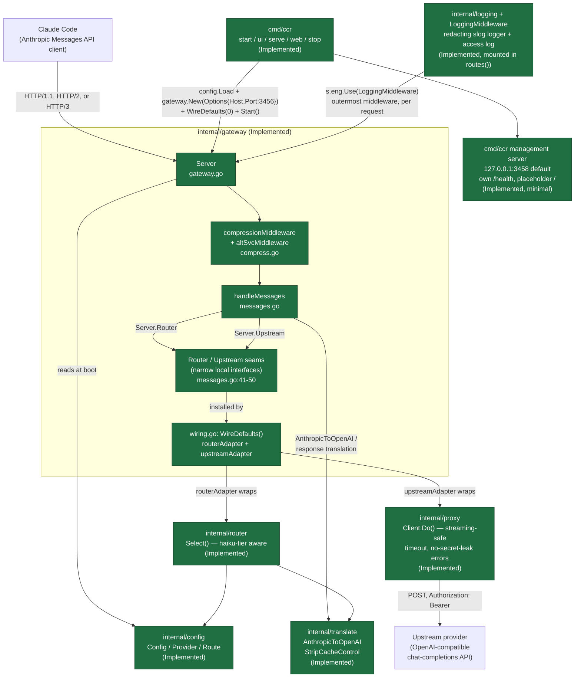
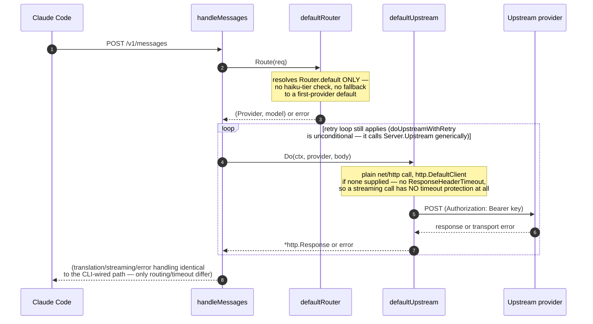
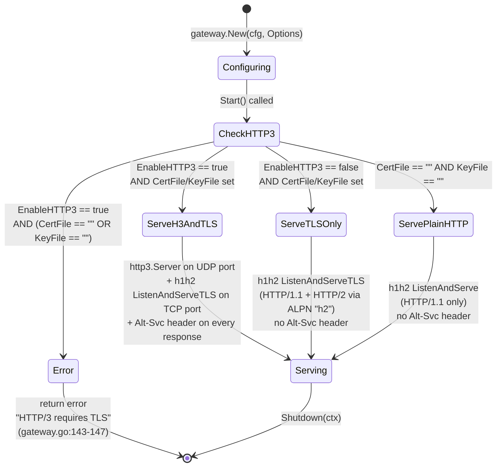

# Architecture

This document describes the components and data flow of `claude-code-router` (Go), as they exist in the repository today, plus the remaining PLANNED pieces. Every diagram distinguishes **Implemented** components/edges from **PLANNED** ones (dashed, labelled).

## Component graph



**Reading this diagram:** `internal/gateway/messages.go` declares its own narrow `Router`/`Upstream` interfaces plus minimal in-package default implementations, so the gateway package compiles and serves correctly on its own, without importing `internal/router`/`internal/proxy` directly (`internal/gateway/messages.go:30-50`, `56-93`). A separate file in the *same* package, `internal/gateway/wiring.go`, adapts the real `internal/router.Select` and `internal/proxy.Client` onto those seams via `Server.WireDefaults(timeout)`. **`cmd/ccr` always calls `WireDefaults`** before starting a gateway (`cmd/ccr/serve.go:44-51`), so a CLI-launched gateway gets the full haiku-tier-aware routing and streaming-safe upstream client — the minimal built-ins (`defaultRouter`/`defaultUpstream`) only matter if `internal/gateway` is used as a library directly, without also calling `WireDefaults`. `internal/logging` and its `LoggingMiddleware` (`internal/gateway/logging_middleware.go`) are now mounted as the outermost middleware in `routes()` (`internal/gateway/gateway.go:152`), so every request is logged once (metadata only, redacted, never bodies/headers); with `cmd/ccr`'s nil `Options.Logger` it falls back to an env-configured (`CCR_LOG_LEVEL`/`CCR_LOG_FORMAT`) redacting logger on stderr. `cmd/ccr` also runs a second, much smaller HTTP server (the "management" interface, default `127.0.0.1:3458`, independently configurable from the gateway) alongside the gateway — it is a separate `net/http.ServeMux` in `cmd/ccr/management.go`, not part of `internal/gateway` at all. The gateway's own default address, `127.0.0.1:3456`, is now independently configurable too, via `--gateway-host`/`--gateway-port` (`cmd/ccr/flags.go`) — see "CLI process/service lifecycle" below and `docs/USER_GUIDE.md` §4.

## Request sequence: `POST /v1/messages`, as launched via `cmd/ccr`

```mermaid
sequenceDiagram
    autonumber
    participant CC as Claude Code
    participant AUTH as RequireAPIKey<br/>(route-scoped on /v1/messages)
    participant MW as compressionMiddleware
    participant H as handleMessages
    participant R as routerAdapter<br/>(wraps router.Select)
    participant T as translate.AnthropicToOpenAI
    participant RT as doUpstreamWithRetry
    participant U as upstreamAdapter<br/>(wraps proxy.Client.Do)
    participant P as Upstream provider

    CC->>AUTH: POST /v1/messages<br/>(Anthropic JSON, Accept-Encoding)
    Note over AUTH: Options.APIKeys empty (cmd/ccr's current<br/>default — no flag/config sets it) => allow all.<br/>Non-empty => Bearer/x-api-key checked,<br/>401 on mismatch. /health, /ready never gated.
    AUTH->>MW: forward (authenticated or auth disabled)
    MW->>H: forward (wraps response writer<br/>if compression negotiated)
    H->>H: decode body -> AnthropicRequest<br/>[400 on bad JSON; 413 over the 32MiB cap]
    H->>R: Route(req)
    Note over R: model contains "haiku" AND<br/>Router.background set?<br/>-> Router.background<br/>else -> Router.default<br/>else -> fallback: first provider,<br/>first model
    R-->>H: (Provider, model) or error<br/>[503 if no route]
    H->>T: AnthropicToOpenAI(req, Options{<br/>CleanCache, StreamOptions,<br/>EnsureToolParameters:true, Model})
    Note over T: image blocks convert to image_url parts;<br/>[400 only for a malformed/unsupported<br/>image source, or e.g. bad content shape]
    T-->>H: OpenAIRequest or error
    H->>H: json.Marshal(OpenAIRequest)<br/>[500 on encode failure]
    alt non-streaming request
        H->>H: ctx = context.WithTimeout(UpstreamTimeout)<br/>(bounds the WHOLE call incl. retries)
    else streaming request
        H->>H: ctx = request context, no context deadline added here
    end
    H->>RT: doUpstreamWithRetry(ctx, provider, body)
    loop up to Options.MaxAttempts (default 3)
        RT->>U: Do(ctx, provider, body)
        Note over U: proxy.Client's Transport.ResponseHeaderTimeout<br/>bounds only the header wait — for a streaming<br/>call this is the ONLY timeout in play
        U->>P: POST provider.APIBaseURL<br/>Authorization: Bearer key<br/>(Authorization never echoed into any error)
        P-->>U: HTTP response (2xx or error) or transport error
        U-->>RT: *http.Response or error
        alt success (status < 400)
            RT-->>H: response, done
        else Retryable (429/5xx status, or timeout/<br/>connection-reset/refused) AND attempts remain
            Note over RT: discard attempt, sleep per<br/>FallbackRetryDelayAfterStatus/AfterNetworkError<br/>(honours Retry-After; exp. backoff otherwise),<br/>then loop again
        else Terminal, or Retryable but exhausted
            RT->>CC: forward exact status code,<br/>Anthropic error envelope [502/504 on transport/ctx]
        end
    end
    alt non-streaming (stream:false)
        H->>H: respondNonStreaming:<br/>OpenAI JSON -> AnthropicMessage
        H->>MW: 200, JSON body
        MW->>CC: (br/gzip-encoded if negotiated)
    else streaming (stream:true)
        loop each upstream SSE chunk
            H->>H: streamAnthropicSSE:<br/>map chunk -> Anthropic event(s)
            H->>CC: event: ...\ndata: ...\n\n<br/>(flushed immediately)
        end
        H->>CC: message_delta, message_stop
    end
```

A streaming response is only ever handed to `streamAnthropicSSE` after the retry loop has produced its final, no-further-retries answer — a mid-stream retry that could corrupt an SSE conversation Claude Code is already consuming is structurally impossible, not merely avoided by convention.

Sources: `internal/gateway/messages.go:189-296` (orchestration), `319-416` (`doUpstreamWithRetry`), `448-504` (error mapping), `538-608` (non-streaming), `621-763` (streaming); `internal/gateway/gateway.go:201` (`RequireAPIKey` mounting); `internal/gateway/wiring.go` (adapters); `cmd/ccr/serve.go:44-51` (the `WireDefaults` call). Verified end-to-end by `internal/gateway/messages_test.go`, `internal/router/router_test.go`, `internal/proxy/proxy_test.go`, and a live smoke test (see `docs/DOC-AUDIT.md`) that measured a 3.0s wall-clock 3-attempt retry sequence against a connection-refused upstream.

## Request sequence: `internal/gateway` used as a library, without `WireDefaults`

If you build `gateway.New(cfg, opt)` yourself and skip `srv.WireDefaults(0)`, you get the package's own minimal built-ins instead — this is what `internal/gateway` falls back to on its own, and is **not** what `cmd/ccr` does:



The retry loop (`doUpstreamWithRetry`) is **not** part of this seam — it lives directly in `handleMessages` and calls `s.Upstream.Do` through the same generic interface either way, so it retries `Retryable` failures the same way whether `Server.Upstream` is `defaultUpstream` or the CLI-wired `proxy.Client` adapter. What differs between the two paths is routing fidelity (`Router.default`-only vs. the full haiku-tier/explicit-selector policy) and upstream timeout protection (none at all vs. `ResponseHeaderTimeout`), not whether a failed attempt gets retried.

Sources: `internal/gateway/messages.go:56-93` (`defaultRouter`, `defaultUpstream`), `319-416` (`doUpstreamWithRetry`, wiring-agnostic).

## Transport negotiation

### Protocol selection (evaluated once, at `Start()`)



Source: `internal/gateway/gateway.go:212-245` (`Start`), `internal/gateway/compress.go:120-128` (`altSvcMiddleware`, registered only when `EnableHTTP3`). Tested at `internal/gateway/gateway_test.go:165-192`. **Note:** `cmd/ccr` always calls `gateway.New(cfg, gateway.Options{Host: flags.GatewayHost, Port: flags.GatewayPort})` with no TLS fields set (`cmd/ccr/serve.go:46`) — so in practice, a CLI-launched gateway always takes the `ServePlainHTTP` branch today, regardless of which host/port it binds. `CertFile`/`KeyFile`/`EnableHTTP3` are only reachable via direct library use; see `docs/USER_GUIDE.md` §5.

### Content-encoding negotiation (evaluated per-request)

```mermaid
stateDiagram-v2
    [*] --> ParseHeader: request arrives,<br/>read Accept-Encoding

    ParseHeader --> NoEncoding: header absent or empty
    ParseHeader --> Tokenize: header present

    Tokenize --> EvaluateTokens: split on comma,<br/>trim, parse ;q= weight<br/>per token (case-insensitive)

    EvaluateTokens --> BrotliAcceptable: "br" token present<br/>with q != 0
    EvaluateTokens --> GzipOnly: "gzip" token present<br/>with q != 0, no usable "br"
    EvaluateTokens --> NoEncoding: neither concrete token<br/>acceptable (e.g. only "*",<br/>"identity", or q=0'd out)

    BrotliAcceptable --> EncodeBrotli: brotli.NewWriter wraps<br/>the response writer
    GzipOnly --> EncodeGzip: gzip.NewWriter wraps<br/>the response writer

    EncodeBrotli --> SetHeaders: Content-Encoding: br<br/>Vary: Accept-Encoding<br/>Content-Length: (removed)
    EncodeGzip --> SetHeaders2: Content-Encoding: gzip<br/>Vary: Accept-Encoding<br/>Content-Length: (removed)
    NoEncoding --> PassThrough: response written<br/>uncompressed, headers untouched

    SetHeaders --> FlushPerWrite: every Flush() call flushes<br/>the compressor, not just the socket<br/>(critical for SSE)
    SetHeaders2 --> FlushPerWrite
    FlushPerWrite --> Close: handler returns -><br/>compressor Close() flushes trailer
    PassThrough --> [*]
    Close --> [*]
```

Source: `internal/gateway/compress.go:39-118` (`negotiate`, `compressionMiddleware`). Negotiation matrix tested exhaustively at `internal/gateway/gateway_test.go:27-47` (e.g. `"br;q=0.1, gzip;q=0.9"` still resolves to brotli — preference is by capability, not `q`). This middleware wraps **every** response on the gateway (3456) — the separate management server (3458, `cmd/ccr/management.go`) does not use it and sends plain, uncompressed responses.

## `cmd/ccr` process/service lifecycle

```mermaid
stateDiagram-v2
    [*] --> NotRunning
    NotRunning --> Detaching: ccr start / ccr ui
    Detaching --> Running: spawnDetached (setsid) launches<br/>"ccr serve" as a child;<br/>PID/host/port written to<br/>~/.claude-code-router/service.json
    NotRunning --> RunningForeground: ccr serve / ccr web<br/>(blocks this terminal)
    RunningForeground --> NotRunning: SIGINT/SIGTERM -><br/>graceful shutdown (10s grace)

    Running --> Running: ccr start / ui again while<br/>tracked PID is alive -> refused,<br/>reports existing PID (exit 1)
    Running --> NotRunning: ccr stop -> SIGTERM,<br/>poll up to 5s, SIGKILL if still alive,<br/>pidfile removed
    Running --> StaleTracked: tracked process dies<br/>on its own (crash, OOM, ...)
    StaleTracked --> NotRunning: ccr stop (or a new start)<br/>detects dead PID, cleans up<br/>the stale pidfile
```

Source: `cmd/ccr/service.go` (pidfile read/write/remove, `processAlive` via signal 0, `spawnDetached` via `setsid` on Unix), `cmd/ccr/serve.go:80-95` (signal handling + graceful shutdown). Tested at `cmd/ccr/main_test.go:67-86`.

## Config data model

```mermaid
classDiagram
    class Config {
        +Provider[] Providers
        +Route Router
        +Validate() error
        +ProviderByName(name) *Provider
    }
    class Provider {
        +string Name
        +string APIBaseURL
        +string APIKey
        +string[] Models
        +Transformer* Transformer
        +Has(name string) bool
    }
    class Transformer {
        +string[] Use
    }
    class Route {
        +string Default
        +string Background
        +string Think
        +string LongContext
    }
    class SplitRoute {
        <<function>>
        +SplitRoute(route string) (provider, model string, err error)
    }

    Config "1" *-- "0..*" Provider : Providers
    Config "1" *-- "1" Route : Router
    Provider "1" o-- "0..1" Transformer : Transformer
    Route ..> SplitRoute : default/background/think/longContext\nparsed as "provider,model"
    Provider ..> SplitRoute : referenced by name

    note for Route "Default/Background/LongContext drive\nrouting (internal/router.Select, wired in\nby cmd/ccr). LongContext fires on an\noversized prompt (>60000 est. tokens).\nThink is wired + unit-tested but inert:\nno thinking signal reaches Select today."
    note for Transformer "Known values: \"cleancache\", \"streamoptions\".\nBoth fully wired end-to-end: streamoptions\ngates stream_options.include_usage;\ncleancache strips cache_control recursively,\nincluding from a tool's input_schema —\nsee docs/FAQ.md Q5."
```

Source: `internal/config/config.go:46-144` (types), `internal/config/config.go:190-249` (`Validate`, `SplitRoute`), `internal/config/config.go:253-260` (`ProviderByName`).

## Why the gateway package doesn't import `internal/router`/`internal/proxy` directly

This is a deliberate seam, not an oversight, and worth calling out architecturally: `internal/router`, `internal/proxy`, and `internal/gateway` were built in parallel by separate efforts against the same `internal/config`/`internal/translate` foundations. Rather than have `internal/gateway` depend on the exact API shape `internal/router`/`internal/proxy` might settle on, `internal/gateway/messages.go` defines its **own** narrow interfaces (`Router`, `Upstream` — `internal/gateway/messages.go:41-50`) and ships minimal working default implementations, so the gateway package is independently testable and functional on its own. A later file in the same package, `internal/gateway/wiring.go`, adapts the real packages onto those seams (`routerAdapter`, `upstreamAdapter`, `Server.WireDefaults`), and `cmd/ccr` always calls it (`cmd/ccr/serve.go:44-51`). The seam still matters for anyone using `internal/gateway` as a library directly: skip the `WireDefaults` call and you silently get `Router.default`-only routing and an upstream client with no header-timeout protection — see `docs/FAQ.md` Q10/Q10a for the exact behavioural differences, and `docs/USER_GUIDE.md` §4.2 for how the CLI closes the gap. (The retry loop is a separate concern and applies either way — see the library-sequence diagram above.)

## Explicitly out of scope (not merely unimplemented)

`test/PORTING-MATRIX.md` — produced by porting the *behavioural intent* of the upstream Node router's own test suites into this Go module — draws a hard line between "missing but wanted" (**GAP**, tracked by a Go test) and "an entire upstream subsystem this router never intended to replicate" (**N/A**). The N/A list is architecturally significant and unchanged: no Electron-style core/gateway process split, no billing telemetry, no ToolHub/MCP runtime, no OAuth provider-plugin auth, no router rules DSL / `ModelRegistry` / `RoutePolicyEngine`, no "Fusion" vendor-specific routing, and no hosted web-search bridging. The multi-protocol surface, however, grew during this documentation pass and is no longer N/A: the gateway now serves **two** inbound families — Anthropic Messages (`/v1/messages`) and an OpenAI chat-completions facade (`/v1/chat/completions`), each also under the `/proxy/v1/...` alias — dispatched through a real path→protocol classifier (`requestProtocolForPath`/`shouldApplyGatewayRouting`, `internal/gateway/protocol.go`; `handleInbound`, `internal/gateway/openai_inbound.go`). OpenAI Responses and Gemini are recognised by that classifier but **not yet served** (no routes registered — they `404`). Outbound is likewise no longer OpenAI-only: a provider may declare `protocol: "anthropic"` (or have it inferred) and receive the request passed through unchanged to a native Messages-API upstream — see below.

Several GAPs the matrix file originally tracked as missing have since landed, at least partially (some fully) — the file's own prose predates this and is stale on these specific rows; trust the code:

- **Explicit per-request provider/model selector** — landed and **live**: `router.Select` resolves a `"provider,model"`/`"provider/model"`-shaped request `model` field before any other routing rule (`internal/router/selector.go`, `internal/router/router.go:26-30`, `50-58`). The related bare-model gap has since been closed too: when no `Router.default` is configured, a bare model served by exactly one provider resolves to that provider, a bare model served by two or more is a loud ambiguity error (never a silent arbitrary pick), and a configured `Router.default` always wins over this last-resort resolution — so ordinary Claude Code requests are unaffected (`internal/router/router.go:72-86`, `internal/router/selector.go`'s `resolveBareModel`; tests `TestSelectResolvesUnambiguousBareModelWhenNoDefault`, `TestSelectRejectsAmbiguousBareModelWhenNoDefault`, `TestSelectDefaultWinsOverBareModelResolution`).
- **Corporate/authenticated outbound proxy** — landed, **partially wired**: environment-variable proxying (`HTTP_PROXY`/`HTTPS_PROXY`/`NO_PROXY`) is automatic for every `proxy.Client` (`internal/proxy/upstream_proxy.go`); an authenticated custom proxy (`proxy.NewWithUpstreamProxy`) is implemented and tested but not wired into `WireDefaults`, and `config.json` has no `proxy` section to configure it from.
- **Retry/fallback on a failed upstream call** — **landed and fully wired**: the classification/backoff *policy* (`internal/router/fallback.go`: `ClassifyStatus`, `ClassifyTransportError`, `FallbackRetryDelayAfterStatus`/`...AfterNetworkError`) is now driven by a real retry loop, `doUpstreamWithRetry` (`internal/gateway/messages.go:319-416`), called from `handleMessages` in place of a single upstream call. Up to `Options.MaxAttempts` (default 3) attempts per request; a `Terminal` failure never retries. No CLI/config surface yet for the attempt budget.
- **Inbound gateway authentication** — **partially landed**: `gateway.RequireAPIKey(keys []string)` (`internal/gateway/auth.go`) is now mounted as route-scoped middleware directly in `gateway.go`'s route table, on `POST /v1/messages` only (`internal/gateway/gateway.go:201`) — `/health`/`/ready` are deliberately never gated. But `cmd/ccr` never populates the new `Options.APIKeys` field (no flag, no config surface), so the accepted-key list is always empty, which the middleware's own documented behaviour treats as "disabled." **The CLI-launched gateway remains unauthenticated by default** — the wiring changed, the operator-facing outcome did not.
- **Provider protocol/type field** — **landed and live**: `config.Provider` now carries an optional `protocol` (`"openai"`/`"anthropic"`), resolved via `ResolvedProtocol()` (explicit value wins; otherwise inferred conservatively from `api_base_url`) and validated by `Config.Validate` (`internal/config/config.go:31-130`, `206-215`). A provider that resolves to `"anthropic"` is routed through `translate.AnthropicPassthrough` (request unchanged) and its response relayed verbatim by `relayAnthropicResponse`, instead of the OpenAI translation path — wired in `handleMessages` at `internal/gateway/messages.go:233-295`. An absent field is inferred as `"openai"` for every config on disk today, so nothing changes for existing deployments.

See `docs/FAQ.md` Q10, Q28, Q29 for the operator-facing version of this.

## Summary: implemented vs. planned

| Layer | Status |
|---|---|
| Config load/validate | Implemented (`internal/config`) |
| Request translation (Anthropic → OpenAI), incl. vision (image → `image_url`) | Implemented (`internal/translate`) |
| Response translation (OpenAI → Anthropic, buffered + SSE) | Implemented, but lives in `internal/gateway/messages.go`, not `internal/translate` |
| `cache_control` stripping | Implemented and fully wired: `translate.StripCacheControl` (`json.Number`-safe) is called from `AnthropicToOpenAI`'s tool-conversion loop whenever `cleancache` is configured (`internal/translate/anthropic.go:441-461`; `docs/FAQ.md` Q5) |
| Retry loop on a failed upstream call | Implemented and live (`doUpstreamWithRetry`, `internal/gateway/messages.go:319-416`), driving `internal/router/fallback.go`'s classification/backoff policy. Attempt budget (`MaxAttempts`, default 3) not yet CLI/config-exposed |
| Inbound gateway authentication (`RequireAPIKey`) | Mounted on `POST /v1/messages`, but unconfigurable — `Options.APIKeys` has no CLI flag/config field, so it is always empty (auth disabled) on a CLI-launched gateway |
| Gateway transport (HTTP/1.1, HTTP/2, HTTP/3, compression) | Implemented; TLS/HTTP-3 not yet CLI-exposed. Bind address/port ARE now CLI-exposed (`--gateway-host`/`--gateway-port`) |
| `GET /health`, `GET /ready`, `POST /v1/messages` | Implemented |
| CLI (`cmd/ccr`: `start`/`ui`/`serve`/`web`/`stop`, pidfile service management) | Implemented |
| Separate management control-plane server | Implemented, deliberately minimal (own `/health`, placeholder `/`) |
| Full haiku-aware routing + streaming-safe upstream client, live in the CLI-launched gateway | Implemented, via `Server.WireDefaults` (always called by `cmd/ccr`) |
| Same, for `internal/gateway` used as a **library** without calling `WireDefaults` | Falls back to minimal built-ins — a real, permanent seam, not a gap to be closed |
| `Router.longContext` routing behaviour | Implemented and live — a request whose estimated prompt exceeds `DefaultLongContextThreshold` (60000 tokens) routes to `Router.LongContext` when configured (`internal/router/selector.go:95-138`, `router.go:130-175`) |
| `Router.think` routing behaviour | Wired but inert — the `chooseRoute` branch exists and is unit-tested, but `translate.AnthropicRequest` has no `thinking` field so `requestWantsThinking` always returns false today (`internal/router/selector.go:140-167`); fires only once a caller-side thinking signal is added |
| Structured logging (`internal/logging`, `internal/gateway/logging_middleware.go`) | Implemented and **live** — a redacting `slog` logger (`CCR_LOG_LEVEL`/`CCR_LOG_FORMAT`) plus a per-request access-log middleware mounted as the outermost middleware in `routes()` (`internal/gateway/gateway.go:152`); metadata-only, never bodies/headers |
| Explicit per-request provider/model selector (`"provider,model"`/`"provider/model"` in the request `model` field) | Implemented and live (`internal/router/selector.go`, wired into `router.Select`) |
| Environment-variable outbound proxy (`HTTP_PROXY`/`HTTPS_PROXY`/`NO_PROXY`) | Implemented and live for every `proxy.Client` (`internal/proxy/upstream_proxy.go`) |
| Authenticated custom outbound proxy | Implemented as a library function (`proxy.NewWithUpstreamProxy`); not wired into `WireDefaults`; no `config.json` section to configure it |
| Retry/fallback classification policy (which failures to retry, backoff schedule, execution planning) | Implemented and tested (`internal/router/fallback.go`), and now actually driving `doUpstreamWithRetry` — see the retry-loop row above |
| Inbound gateway authentication | `RequireAPIKey` is mounted on `POST /v1/messages` (`internal/gateway/gateway.go:201`) but unconfigurable from the CLI — see the row above; unauthenticated by default in practice |
| Provider `protocol` field (`"openai"`/`"anthropic"`) + Anthropic-native passthrough | Implemented and live (`internal/config/config.go` `ResolvedProtocol`; `internal/translate/anthropic.go` `AnthropicPassthrough`; wired in `internal/gateway/messages.go:233-295`). Absent field infers `"openai"`, so existing configs are unchanged |
| Bare-model resolution (unambiguous, no-`Router.default` window; ambiguous → loud error) | Implemented (`internal/router/router.go:72-86`, `internal/router/selector.go` `resolveBareModel`) |
| Multi-protocol (OpenAI Responses, Gemini), ToolHub/MCP, billing, rules DSL, hosted web search, Electron core/gateway split | **N/A — out of scope by design**, not merely unimplemented |
