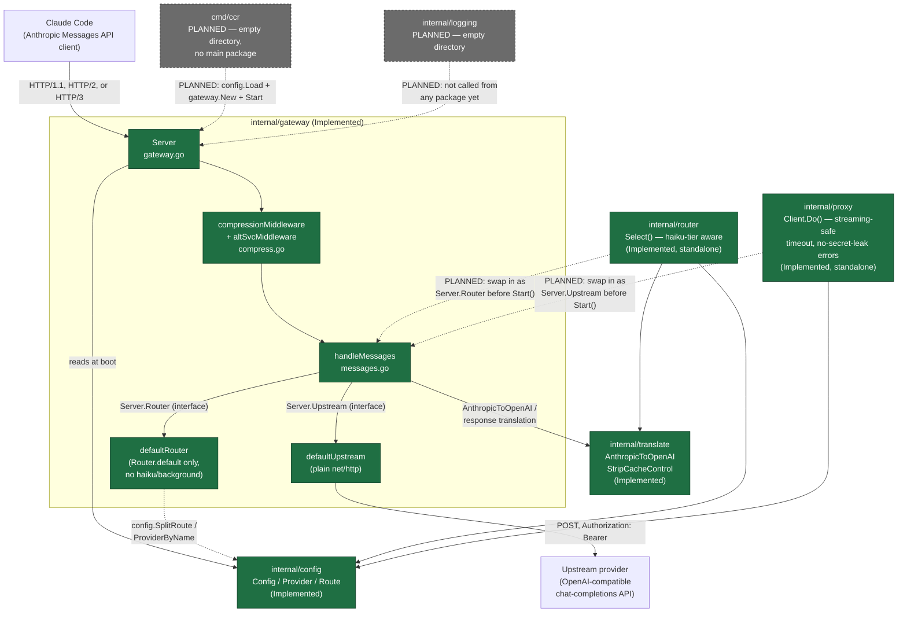
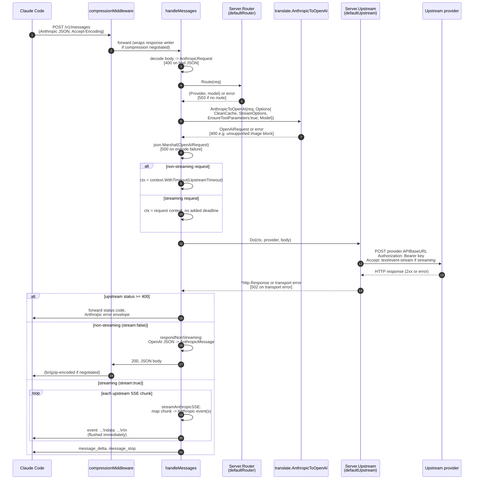
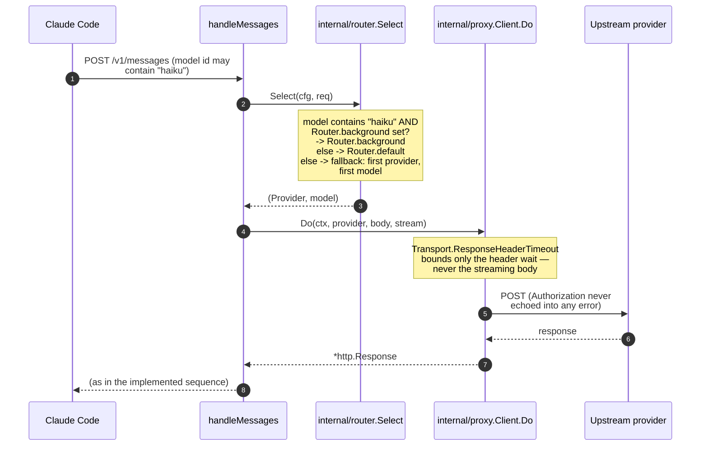
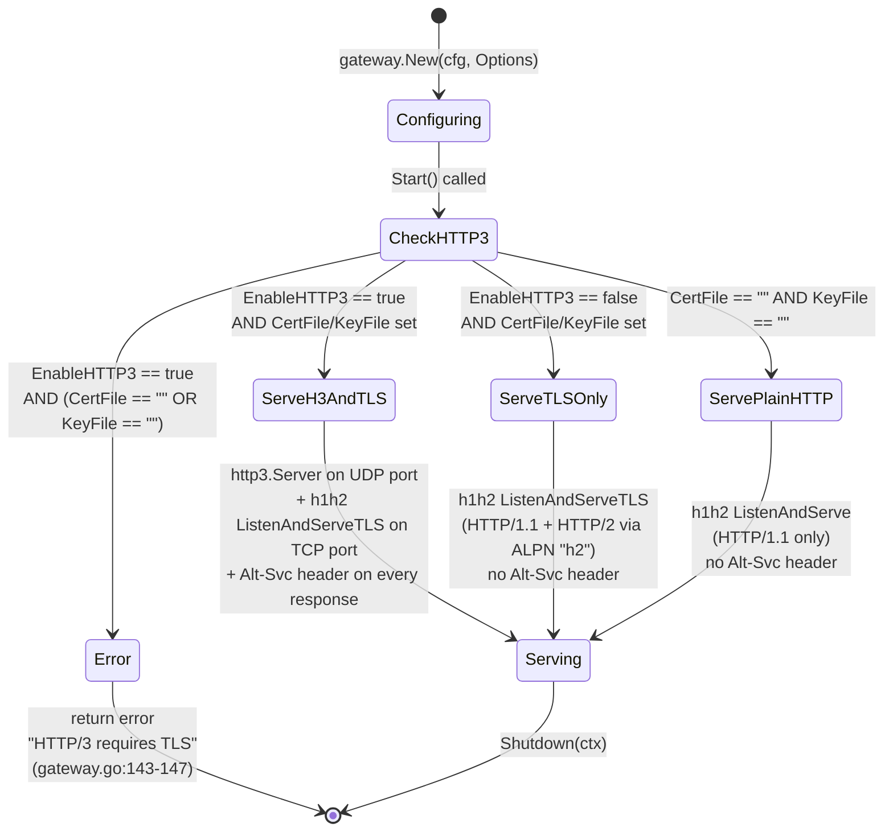

# Architecture

This document describes the components and data flow of `claude-code-router` (Go), as they exist in the repository today, plus the PLANNED pieces needed to make it a runnable service. Every diagram distinguishes **Implemented** components/edges from **PLANNED** ones (dashed, labelled).

## Component graph



**Reading this diagram:** the solid box around `internal/gateway` is the only thing that runs end-to-end today. `internal/router` and `internal/proxy` are fully implemented and independently tested, but the gateway package deliberately does not import them (`internal/gateway/messages.go:19-27`) — it defines its own minimal `Router`/`Upstream` interfaces (`DefRouter`/`DefUpstream` above) so it works standalone. `Server.Router`/`Server.Upstream` are exported fields a caller can overwrite before `Start()` to get the fuller behaviour; whether `cmd/ccr` does that once it exists is unconfirmed. `internal/logging` is not called from anywhere yet.

## Request sequence (implemented path)

This is the sequence for the code that exists and is tested today — `POST /v1/messages` served through `defaultRouter`/`defaultUpstream`.



Sources: `internal/gateway/messages.go:178-244` (orchestration), `258-318` (error mapping), `322-382` (non-streaming), `384-547` (streaming). Verified end-to-end by `internal/gateway/messages_test.go`.

## Request sequence (PLANNED — full routing/proxy wiring)

If `cmd/ccr` (or any caller) swaps `Server.Router`/`Server.Upstream` for adapters around `internal/router.Select` and `internal/proxy.Client` before calling `Start()`, the sequence gains haiku-tier-aware routing and header-only upstream timeouts:



This diagram is a **design projection**, not a description of running code — no file in this repository currently performs this wiring. Sources for the individual behaviours: `internal/router/router.go:40-63`, `internal/proxy/proxy.go:26-84`.

## Transport negotiation

### Protocol selection (evaluated once, at `Start()`)



Source: `internal/gateway/gateway.go:135-168` (`Start`), `internal/gateway/compress.go:120-128` (`altSvcMiddleware`, registered only when `EnableHTTP3`). Tested at `internal/gateway/gateway_test.go:165-192`.

### Content-encoding negotiation (evaluated per-request)

```mermaid
stateDiagram-v2
    [*] --> ParseHeader: request arrives,<br/>read Accept-Encoding

    ParseHeader --> NoEncoding: header absent or empty
    ParseHeader --> Tokenize: header present

    Tokenize --> EvaluateTokens: split on comma,<br/>trim, parse ;q= weight<br/>per token (case-insensitive)

    EvaluateTokens --> BrotliAcceptable: "br" token present<br/>with q != 0
    EvaluateTokens --> GzipOnly: "gzip" token present<br/>with q != 0, no usable "br"
    EvaluateTokens --> NoEncoding: neither concrete token<br/>acceptable (e.g. only "*",<br/>"identity", or q=0'd out)

    BrotliAcceptable --> EncodeBrotli: brotli.NewWriter wraps<br/>the response writer
    GzipOnly --> EncodeGzip: gzip.NewWriter wraps<br/>the response writer

    EncodeBrotli --> SetHeaders: Content-Encoding: br<br/>Vary: Accept-Encoding<br/>Content-Length: (removed)
    EncodeGzip --> SetHeaders2: Content-Encoding: gzip<br/>Vary: Accept-Encoding<br/>Content-Length: (removed)
    NoEncoding --> PassThrough: response written<br/>uncompressed, headers untouched

    SetHeaders --> FlushPerWrite: every Flush() call flushes<br/>the compressor, not just the socket<br/>(critical for SSE)
    SetHeaders2 --> FlushPerWrite
    FlushPerWrite --> Close: handler returns -><br/>compressor Close() flushes trailer
    PassThrough --> [*]
    Close --> [*]
```

Source: `internal/gateway/compress.go:39-118` (`negotiate`, `compressionMiddleware`). Negotiation matrix tested exhaustively at `internal/gateway/gateway_test.go:27-47` (e.g. `"br;q=0.1, gzip;q=0.9"` still resolves to brotli — preference is by capability, not `q`).

## Config data model

```mermaid
classDiagram
    class Config {
        +Provider[] Providers
        +Route Router
        +Validate() error
        +ProviderByName(name) *Provider
    }
    class Provider {
        +string Name
        +string APIBaseURL
        +string APIKey
        +string[] Models
        +Transformer* Transformer
        +Has(name string) bool
    }
    class Transformer {
        +string[] Use
    }
    class Route {
        +string Default
        +string Background
        +string Think
        +string LongContext
    }
    class SplitRoute {
        <<function>>
        +SplitRoute(route string) (provider, model string, err error)
    }

    Config "1" *-- "0..*" Provider : Providers
    Config "1" *-- "1" Route : Router
    Provider "1" o-- "0..1" Transformer : Transformer
    Route ..> SplitRoute : default/background/think/longContext\nparsed as "provider,model"
    Provider ..> SplitRoute : referenced by name

    note for Route "Only Default/Background currently\ndrive routing behaviour (internal/router\nand the gateway's defaultRouter).\nThink/LongContext are validated but\nunconsumed — PLANNED."
    note for Transformer "Known values: \"cleancache\", \"streamoptions\".\nMapped to translate.Options by\nrouter.TransformerOptions (standalone,\nnot wired into the live gateway) and,\nseparately, inline in messages.go\nvia Provider.Has(...)."
```

Source: `internal/config/config.go:31-76` (types), `internal/config/config.go:122-172` (`Validate`, `SplitRoute`), `internal/config/config.go:174-182` (`ProviderByName`).

## Why the gateway package doesn't import `internal/router`/`internal/proxy`

This is a deliberate seam, not an oversight, and worth calling out architecturally: three packages (`internal/router`, `internal/proxy`, `internal/gateway`) were built in parallel by separate efforts against the same `internal/config`/`internal/translate` foundations. Rather than have `internal/gateway` depend on the exact API shape `internal/router`/`internal/proxy` might settle on, `internal/gateway/messages.go` defines its **own** narrow interfaces (`Router`, `Upstream` — `internal/gateway/messages.go:29-39`) and ships minimal working default implementations, so the gateway is independently testable and functional before those integration decisions are finalised. The cost of this seam is that, as shipped, the live gateway's routing is `Router.default`-only (no haiku-tier awareness) and its upstream timeout semantics differ from `internal/proxy.Client`'s (a whole-call context deadline for non-streaming requests, vs. a response-header-only deadline) — see `docs/FAQ.md` Q10, Q10a, and Q18 for the exact behavioural differences, and `docs/USER_GUIDE.md` §4.1 for how to close the gap by assigning `Server.Router`/`Server.Upstream` before `Start()`.

## Summary: implemented vs. planned

| Layer | Status |
|---|---|
| Config load/validate | Implemented (`internal/config`) |
| Request translation (Anthropic → OpenAI) | Implemented (`internal/translate`) |
| Response translation (OpenAI → Anthropic, buffered + SSE) | Implemented, but lives in `internal/gateway/messages.go`, not `internal/translate` |
| `cache_control` stripping | Implemented as a function (`translate.StripCacheControl`); not observed to be called from `internal/gateway/messages.go` — `cleancache` is passed to `AnthropicToOpenAI` via `Options.CleanCache`, but that field is not read inside `AnthropicToOpenAI` itself (see `docs/FAQ.md` and the field's doc comment) |
| Gateway transport (HTTP/1.1, HTTP/2, HTTP/3, compression) | Implemented |
| `GET /health`, `GET /ready`, `POST /v1/messages` | Implemented |
| Full haiku-aware routing live in the gateway | PLANNED (library exists, not wired) |
| Streaming-safe/secret-safe upstream client live in the gateway | PLANNED (library exists, not wired) |
| `Router.think` / `Router.longContext` routing behaviour | PLANNED (config accepts and validates the fields; nothing consumes them) |
| CLI (`cmd/ccr`) | PLANNED (empty directory) |
| Structured logging (`internal/logging`) | PLANNED (empty directory) |
