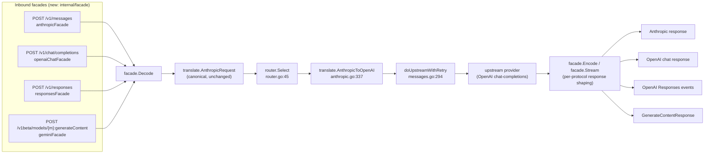
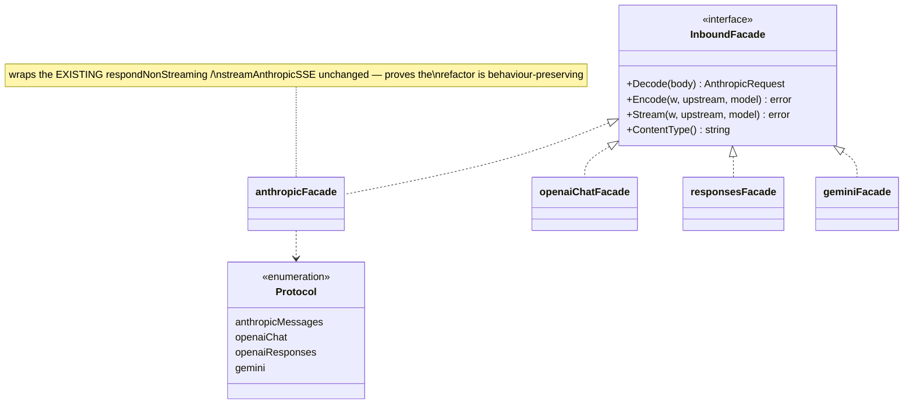
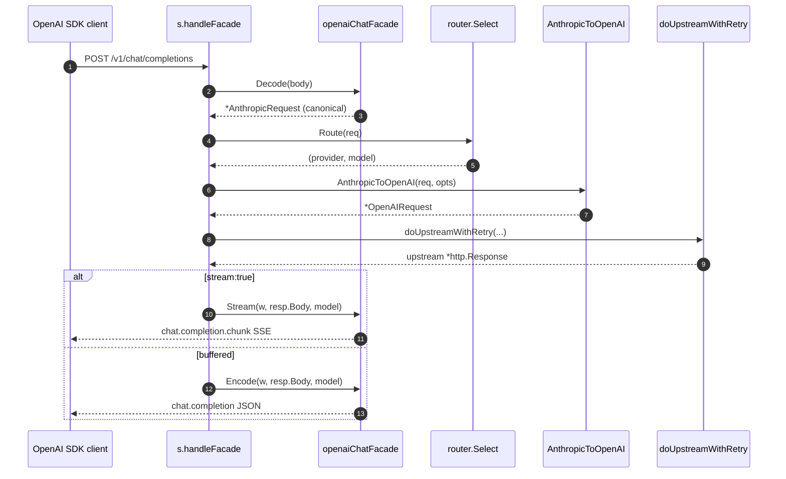
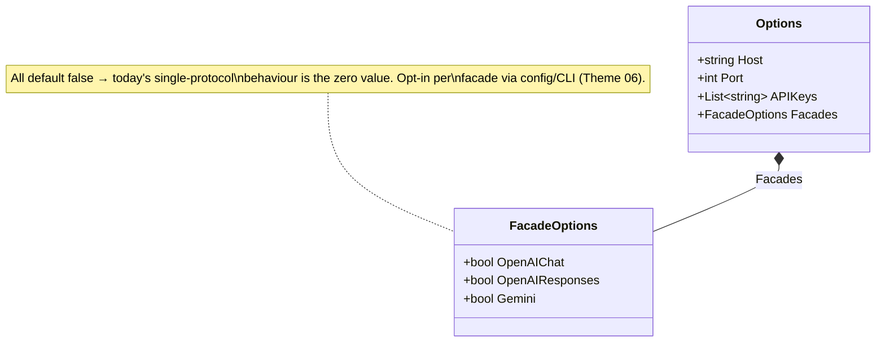

# 01 — Multi-protocol inbound facades

> Accept **OpenAI Chat Completions**, **OpenAI Responses**, and **Gemini
> `generateContent`** requests at the front door, normalising each into the
> canonical `translate.AnthropicRequest` the rest of the gateway already
> understands.

## Problem statement

The gateway speaks exactly one inbound dialect. `gateway.go`'s route table
registers a single content endpoint, `POST /v1/messages`, and
`handleMessages` unmarshals the body straight into `translate.AnthropicRequest`
(`internal/gateway/gateway.go:161`, `internal/gateway/messages.go:216-220`). Any
client that is not Claude Code — the OpenAI Python/JS SDK, a Gemini SDK, Codex,
LangChain's OpenAI provider — cannot talk to this gateway at all, even though the
upstream side already speaks OpenAI chat-completions. `test/PORTING-MATRIX.md`
lists OpenAI Responses (item 1), Gemini `generateContent` (items 8, 11), and the
path→protocol classifier `requestProtocolForPath` (item 14) as **N/A — out of
scope by design**. This theme reframes them as **opt-in inbound facades**: purely
additive endpoints that reuse the entire existing routing/translation/upstream
pipeline, so one gateway can serve every popular client.

## Why it matters here (grounded)

- **The canonical form already exists.** `translate.AnthropicRequest`
  (`internal/translate/anthropic.go:39-51`) is a complete internal representation
  — model, system, messages (polymorphic content blocks), tools, sampling
  params, stream flag. Every facade's job is just *"decode protocol X into
  `AnthropicRequest`"*; from there `router.Select` →
  `translate.AnthropicToOpenAI` → `doUpstreamWithRetry` runs unchanged.
- **The response side is already protocol-specific and isolated.**
  `respondNonStreaming` and `streamAnthropicSSE`
  (`internal/gateway/messages.go:482-707`) build the *Anthropic* wire response
  from the *OpenAI* upstream body. A facade needs the mirror: build the
  *inbound protocol's* wire response from the same OpenAI upstream body. The
  OpenAI upstream wire types (`openAIChatResponse`, `openAIStreamChunk`,
  `internal/gateway/messages.go:126-168`) are the shared substrate both
  directions read.
- **Route registration is a one-liner pattern.** `s.eng.POST("/v1/messages",
  RequireAPIKey(...), s.handleMessages)` (`gateway.go:161`) is trivially
  extended with sibling routes, each wrapped by the same `RequireAPIKey`
  middleware.
- **The classifier gap is real and testable.**
  `internal/gateway/protocol_endpoints_port_test.go`'s
  `TestRequestProtocolForPath_GAP` already documents the missing
  path→protocol classifier this theme delivers.

## Design overview

Introduce an `internal/facade` package with one interface. A facade owns three
concerns for its protocol: **decode** an inbound request into `AnthropicRequest`,
**encode** a buffered upstream result into the protocol's response shape, and
**stream** the upstream SSE re-framed into the protocol's SSE dialect. The gin
handler becomes protocol-agnostic — it selects a facade by route, then runs the
identical core.

```
inbound bytes ──▶ facade.Decode ──▶ translate.AnthropicRequest ──▶ router.Select
                                                                        │
        (existing pipeline, unchanged) translate.AnthropicToOpenAI ◀────┘
                                                     │
                                          doUpstreamWithRetry ──▶ upstream
                                                     │
             facade.Encode / facade.Stream ◀── OpenAI upstream body
                        │
                inbound protocol response
```

The current Anthropic path becomes just *the first facade* (`anthropicFacade`),
so `handleMessages` is refactored to `handle(facade)` with zero behaviour change
for `/v1/messages`.

### Protocol mapping cheatsheet (grounded in the wire-format research)

| Concern | OpenAI Chat (`/v1/chat/completions`) | OpenAI Responses (`/v1/responses`) | Gemini (`:generateContent`) |
|---|---|---|---|
| System prompt | `messages[0]` with `role:"system"` | top-level `instructions` | top-level `systemInstruction.parts[].text` |
| Turns | `messages[]` (`role`+`content`) | `input` (string or item array) | `contents[]` (`role`+`parts[]`) |
| Tools | `tools[].function` | `tools[]` | `tools[].functionDeclarations[]` |
| Stream flag | `stream:true` | `stream:true` | `:streamGenerateContent?alt=sse` |
| Stream deltas | `chat.completion.chunk` (`choices[].delta`) | typed events `response.output_text.delta`, `response.completed` | **full `GenerateContentResponse` snapshot per SSE event** (no deltas, no named events) |

Sources: [OpenAI Responses streaming events](https://developers.openai.com/api/reference/resources/responses/streaming-events),
[Gemini `generateContent`](https://ai.google.dev/api/generate-content),
[Gemini native streaming format](https://docs.apiyi.com/en/api-capabilities/gemini/response-handling).

## Phases → Tasks → Sub-tasks

### Phase 1 — Facade seam + OpenAI Chat Completions (closest to existing types)

- **Task 1.1 — Path→protocol classifier** (closes `TestRequestProtocolForPath_GAP`)
  - 1.1.1 `facade.Protocol` enum: `anthropicMessages`, `openaiChat`,
    `openaiResponses`, `gemini`.
  - 1.1.2 `RequestProtocolForPath(method, path) (Protocol, bool)` pure function,
    table-driven, ported against the upstream test table.
  - 1.1.3 Unit test mirroring the GAP test's 11 recognised + 2 unrecognised rows.
- **Task 1.2 — `InboundFacade` interface + `anthropicFacade`**
  - 1.2.1 Define the interface (see Micro-POC).
  - 1.2.2 Extract today's `handleMessages` body into `anthropicFacade`
    (`Decode` = `json.Unmarshal` into `AnthropicRequest`; `Encode`/`Stream` =
    the existing `respondNonStreaming`/`streamAnthropicSSE`), so `/v1/messages`
    is byte-for-byte unchanged. Golden-file test proves it.
  - 1.2.3 Refactor `handleMessages` → generic `s.handle(f InboundFacade)`.
- **Task 1.3 — `openaiChatFacade`**
  - 1.3.1 `Decode`: map `messages[]`/`tools[]`/sampling → `AnthropicRequest`
    (system message → `System`; each `content` string/array → content blocks;
    `tool_calls` → `tool_use`; `role:"tool"` → `tool_result`).
  - 1.3.2 `Encode`: OpenAI upstream body is already OpenAI-shaped — the buffered
    case is largely a pass-through with id/usage normalisation.
  - 1.3.3 `Stream`: re-emit `chat.completion.chunk` frames (again close to the
    upstream shape).
  - 1.3.4 Register `POST /v1/chat/completions` behind a config gate.

### Phase 2 — Gemini `generateContent`

- **Task 2.1 — `geminiFacade.Decode`**: `contents[].parts[]` → messages,
  `systemInstruction` → `System`, `tools[].functionDeclarations` → tools,
  `functionCall`/`functionResponse` parts → `tool_use`/`tool_result`.
- **Task 2.2 — Path-embedded model + method**: parse
  `/v1beta/models/{model}:generateContent` and `:streamGenerateContent`; set
  `AnthropicRequest.Model` from the path (this is the "Gemini path-model adapter"
  from PORTING-MATRIX item 8).
- **Task 2.3 — `geminiFacade.Encode`/`Stream`**: build
  `GenerateContentResponse` (`candidates[].content.parts[]`); streaming emits a
  **full snapshot per SSE `data:` line**, not deltas — the accumulator lives in
  the facade.
- **Task 2.4 — Gemini finish-reason + usage mapping** (`STOP`/`MAX_TOKENS`/
  `usageMetadata`).

### Phase 3 — OpenAI Responses + Codex bridge

- **Task 3.1 — `responsesFacade.Decode`**: `input` (string or item array) →
  messages, `instructions` → `System`.
- **Task 3.2 — `responsesFacade.Stream`**: typed event sequence
  (`response.created` → `response.output_text.delta`* →
  `response.completed`), with `sequence_number`/`output_index`/`content_index`
  bookkeeping (the mirror of `streamAnthropicSSE`'s block-index bookkeeping).
- **Task 3.3 — Codex `apply_patch` ↔ `virtual_apply_patch` bridge** (optional;
  PORTING-MATRIX item 1): rewrite the `custom` apply_patch tool into a `function`
  round-trip and back on the response `output_item.done` event.

## Micro-POC

The interface and a working slice of the OpenAI-Chat decoder, expressed entirely
in this repo's real types (`translate.AnthropicRequest`,
`translate.AnthropicMessage`, `internal/gateway`'s OpenAI wire structs).

```go
// internal/facade/facade.go  (sketch)
package facade

import (
	"io"
	"net/http"

	"github.com/vasic-digital/claude-code-router/internal/translate"
)

// InboundFacade adapts one client-facing wire protocol onto the gateway's
// canonical translate.AnthropicRequest pipeline. The three methods mirror the
// three things internal/gateway/messages.go already does for the Anthropic
// protocol: decode a request, encode a buffered response, re-frame an SSE
// stream.
type InboundFacade interface {
	// Decode turns a raw inbound body into the canonical request.
	Decode(body []byte) (*translate.AnthropicRequest, error)
	// Encode writes a buffered upstream (OpenAI chat-completions) body back to
	// the client in this protocol's shape. model is the routed model id.
	Encode(w http.ResponseWriter, upstream io.Reader, model string) error
	// Stream re-frames an upstream OpenAI SSE stream as this protocol's SSE.
	Stream(w http.ResponseWriter, upstream io.Reader, model string) error
	// ContentType is the response Content-Type for the buffered path.
	ContentType() string
}
```

```go
// internal/facade/openai_chat.go  (sketch — Phase 1, Decode only)
package facade

import (
	"encoding/json"
	"fmt"

	"github.com/vasic-digital/claude-code-router/internal/translate"
)

type openAIChatRequest struct {
	Model       string   `json:"model"`
	MaxTokens   int      `json:"max_tokens"`
	Temperature *float64 `json:"temperature"`
	TopP        *float64 `json:"top_p"`
	Stream      bool     `json:"stream"`
	Stop        []string `json:"stop"`
	Messages    []struct {
		Role    string          `json:"role"`
		Content json.RawMessage `json:"content"` // string or content-part array
	} `json:"messages"`
	Tools []struct {
		Function struct {
			Name        string          `json:"name"`
			Description string          `json:"description"`
			Parameters  json.RawMessage `json:"parameters"`
		} `json:"function"`
	} `json:"tools"`
}

type OpenAIChatFacade struct{}

func (OpenAIChatFacade) Decode(body []byte) (*translate.AnthropicRequest, error) {
	var in openAIChatRequest
	if err := json.Unmarshal(body, &in); err != nil {
		return nil, fmt.Errorf("openai-chat: invalid JSON: %w", err)
	}
	out := &translate.AnthropicRequest{
		Model:         in.Model,
		MaxTokens:     in.MaxTokens,
		Temperature:   in.Temperature,
		TopP:          in.TopP,
		StopSequences: in.Stop, // AnthropicRequest field is StopSequences (anthropic.go:49)
		Stream:        in.Stream,
	}
	for _, m := range in.Messages {
		// A leading system message becomes the top-level System field, exactly
		// the inverse of translate.AnthropicToOpenAI's system-prompt promotion
		// (anthropic.go:355-365).
		if m.Role == "system" {
			out.System = m.Content
			continue
		}
		out.Messages = append(out.Messages, translate.AnthropicMessage{
			Role:    m.Role,
			Content: m.Content, // string/array both round-trip via RawMessage
		})
	}
	for _, t := range in.Tools {
		out.Tools = append(out.Tools, translate.AnthropicTool{
			Name:        t.Function.Name,
			Description: t.Function.Description,
			InputSchema: t.Function.Parameters,
		})
	}
	return out, nil
}
```

Route wiring reuses the existing pattern from `gateway.go:161`:

```go
// internal/gateway/gateway.go  routes()  (sketch addition)
if s.opt.Facades.OpenAIChat {
	s.eng.POST("/v1/chat/completions",
		RequireAPIKey(s.opt.APIKeys),
		s.handleFacade(facade.OpenAIChatFacade{}))
}
```

### Runnable shell demo of the end goal

Once Phase 1 lands, an unmodified OpenAI SDK works against the gateway:

```bash
# The stock OpenAI client, pointed at the gateway, with no code changes:
export OPENAI_BASE_URL="http://127.0.0.1:3456/v1"
export OPENAI_API_KEY="$GATEWAY_KEY"   # gateway-side key, see Theme 04/06
curl -s "$OPENAI_BASE_URL/chat/completions" \
  -H "Authorization: Bearer $OPENAI_API_KEY" \
  -H 'Content-Type: application/json' \
  -d '{"model":"gpt-4o","messages":[{"role":"user","content":"ping"}]}'
# → routed by router.Select, translated, sent to the configured upstream,
#   returned in OpenAI chat-completions shape.
```

## Diagrams

### Facade pipeline (all four protocols funnel into one core)



### Facade type model



### OpenAI Chat request sequence



## Data definitions

No persistent state. The structural model is the `InboundFacade` interface and
the config gate that decides which facades are mounted:



## Acceptance criteria

- **Phase 1**: `/v1/messages` output is byte-identical to today (golden test);
  the stock OpenAI SDK completes a non-streaming and a streaming
  `/v1/chat/completions` call through the gateway; `RequestProtocolForPath`
  passes the ported upstream table; every facade route is gated off by default.
- **Phase 2**: a Gemini SDK completes `:generateContent` and
  `:streamGenerateContent` calls; the model is taken from the path; streaming
  emits full-snapshot SSE events.
- **Phase 3**: the OpenAI Responses SDK completes streaming with correct typed
  events and `sequence_number` ordering.
- **All phases**: no facade path can leak the upstream `api_key` (reuses
  `proxy.go`'s guarantee); every facade has fuzz coverage on `Decode`
  (mirroring `internal/translate/anthropic_fuzz_test.go`).

## Risks & backward-compatibility

- **Scope creep vs. the port's charter.** PORTING-MATRIX deliberately marks
  these N/A. Mitigation: facades are a *new, separate package* and every route
  is **off by default** — the port's core stays a pure Anthropic⇄OpenAI
  translator; facades are an additive product surface, not a change to it.
- **Response-shape fidelity is the hard part.** Streaming event ordering
  (Responses' `sequence_number`, Gemini's snapshot semantics) is where bugs
  hide. Mitigation: each facade's `Stream` is a direct structural mirror of the
  well-tested `streamAnthropicSSE`, and each gets a recorded-upstream replay
  test.
- **Tool-call round-tripping across dialects** (OpenAI `tool_calls` ↔ Anthropic
  `tool_use` ↔ Gemini `functionCall`) is lossy if rushed. Mitigation: land
  text-only first (Phase 1 sub-tasks 1.3.1–1.3.3), add tool mapping as an
  explicit, separately-tested sub-task.
- **Backward-compat**: zero. No existing route, config key, or behaviour
  changes; the `FacadeOptions` zero value is today's gateway.
