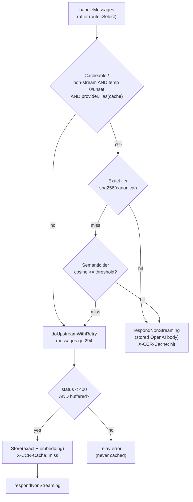
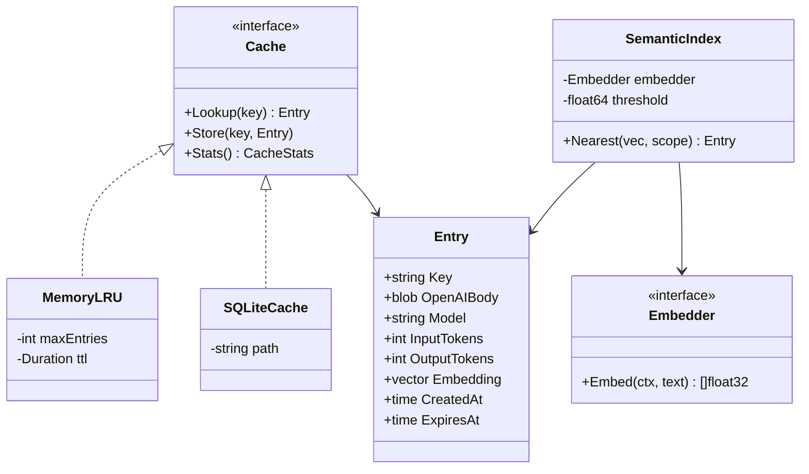

# 02 — Semantic response cache

> A two-tier cache — exact-match first, embedding-similarity second — in front of
> the upstream call, so repeated and near-duplicate requests are served locally
> instead of paying a provider round-trip.

## Problem statement

Every `/v1/messages` request hits the upstream. `handleMessages` decodes, routes,
translates, and unconditionally calls `doUpstreamWithRetry`
(`internal/gateway/messages.go:258`) — there is no lookup, no short-circuit, no
reuse. Claude Code and agent workloads are heavy on repetition: identical system
prompts, re-asked questions after a tool error, title/summary generation on the
same content, retries after a client-side timeout. Each of those is a full paid
generation. A cache that recognises an *identical* request (cheap, exact) and a
*semantically equivalent* one (embedding similarity) can cut both cost and tail
latency materially — production semantic caches report 30–70% hit rates
depending on traffic ([Spheron](https://www.spheron.network/blog/semantic-cache-llm-inference-gpu-cloud/)).

## Why it matters here (grounded)

- **There is exactly one, well-marked insertion point.** The line between
  translation and upstream in `handleMessages`
  (`internal/gateway/messages.go:242-258`) is the natural cache checkpoint:
  after routing (so the cache key can include the resolved model) and before the
  paid call.
- **The per-provider opt-in mechanism already exists.**
  `config.Provider.Transformer.Use` is a list of named behaviours the code reads
  with `provider.Has("...")` (`internal/config/config.go:52-62`,
  used at `internal/gateway/messages.go:229-230`). A `"cache"` entry — or a
  top-level `Cache` config section — fits that established pattern exactly.
- **The upstream body is already fully buffered on the non-streaming path.**
  `respondNonStreaming` does `io.ReadAll(io.LimitReader(body, 32<<20))`
  (`internal/gateway/messages.go:483`) — that same buffered OpenAI body is
  trivially storable as a cache value with no extra plumbing.
- **Canonicalisation infrastructure is already present.**
  `translate.StripCacheControl` walks the JSON tree with `json.Number` fidelity
  (`internal/translate/anthropic.go:495-503`); the same discipline gives a
  stable, canonical cache key that is invariant to `cache_control` noise and
  number re-encoding.

## Design overview

Two tiers, checked in order, both keyed on a **canonical request fingerprint**
that includes the resolved model and provider (never the API key):

1. **Exact tier** — `sha256(canonical-request-JSON)`. O(1) map/DB lookup. Safe,
   deterministic, no false positives. Ships first.
2. **Semantic tier** — embed the request's salient text (last user turn + system
   hash), nearest-neighbour search over stored embeddings, accept if cosine
   similarity ≥ threshold. Higher hit rate, but carries a correctness risk that
   the design must fence off.

Both tiers respect the streaming/tool safety rules the codebase already lives
by. The cache is **opt-in and conservative by default**: only non-streaming,
low-temperature requests are cacheable initially, matching the industry warning
that aggressive semantic caching has shipped wrong answers to users
([respan.ai](https://www.respan.ai/articles/semantic-cache-llm)).

### Safety gates (the difference between a feature and an incident)

- **Temperature gate.** Only cache when `temperature` is absent or `0` — a
  sampled response is not reusable. `AnthropicRequest.Temperature`
  (`internal/translate/anthropic.go:47`) is a `*float64`, so "unset" is
  distinguishable from `0`.
- **Tool gate.** By default do **not** cache responses that contain `tool_use`
  (the answer depends on live tool state). Configurable.
- **Scope isolation.** The key includes model + a hash of the full system
  prompt + tools, so two agents with different instructions never collide.
- **TTL + explicit bust.** Every entry has a TTL; a config reload (Theme 06)
  bumps a generation counter that invalidates the tier wholesale.
- **Adaptive threshold.** Higher similarity floor for code/tool-shaped prompts,
  lower for chat — the tradeoff current research recommends over one fixed
  `0.8` ([arXiv 2507.07061](https://arxiv.org/pdf/2507.07061)).

## Phases → Tasks → Sub-tasks

### Phase 1 — Exact-match cache (no embeddings, no new heavy deps)

- **Task 1.1 — `internal/cache` package + `Cache` interface**
  - 1.1.1 `Lookup(key) (*Entry, bool)`, `Store(key, Entry)`, `Stats()`.
  - 1.1.2 In-memory tier: size-bounded LRU with TTL (stdlib
    `container/list` + map; no dependency).
- **Task 1.2 — Canonical fingerprint**
  - 1.2.1 `Fingerprint(req *AnthropicRequest, provider, model string) string`:
    strip `cache_control`, sort object keys, drop `stream`, `sha256`.
  - 1.2.2 Property test: fingerprint invariant to key order and `cache_control`
    presence; sensitive to model/system/tools/messages.
- **Task 1.3 — Wire the checkpoint into `handleMessages`**
  - 1.3.1 Gate: cacheable only if non-stream, temperature 0/unset, provider has
    `"cache"`.
  - 1.3.2 Lookup → hit: serve stored OpenAI body straight through
    `respondNonStreaming`. Miss → call upstream, then `Store` on 2xx.
  - 1.3.3 Emit `X-CCR-Cache: hit|miss` response header for observability
    (feeds Theme 04 metrics).
- **Task 1.4 — Optional SQLite persistence** (survives restart)
  - 1.4.1 `modernc.org/sqlite` (pure-Go, **no CGO** — keeps the static-binary
    property) behind a build-tolerant interface.
  - 1.4.2 DDL below; write-through from the in-memory tier.

### Phase 2 — Semantic tier

- **Task 2.1 — Embedding provider abstraction**
  - 2.1.1 `Embedder.Embed(ctx, text) ([]float32, error)`; a `config.Provider`
    can be flagged as the embedding source (reuse the provider record).
  - 2.1.2 Text extraction: last user message text + system hash (bounded length).
- **Task 2.2 — Vector store + nearest-neighbour**
  - 2.2.1 Brute-force cosine over the candidate set filtered by exact-tier
    metadata (model + system hash) — correct and simple for the small per-scope
    N a single gateway sees.
  - 2.2.2 Optional `sqlite-vec` extension path for larger deployments.
- **Task 2.3 — Threshold policy**
  - 2.3.1 Per-request-class thresholds (code vs chat), configurable.
  - 2.3.2 Anti-false-positive guard: on a semantic hit, optionally re-check exact
    system/tool-hash equality before serving.

### Phase 3 — Streaming cache + analytics

- **Task 3.1 — Streaming replay**: assemble the full response during
  `streamAnthropicSSE`, store it, and on a later hit **replay** it as a fresh SSE
  stream (chunked with small delays so the client UX is unchanged).
- **Task 3.2 — Static/dynamic tiering**: a curated static tier (vetted answers
  mined from logs) in front of the online dynamic tier — the production pattern.
- **Task 3.3 — Cache analytics**: hit rate, tokens/dollars saved, false-positive
  reports; persisted in `cache_stats` for the management UI.

## Micro-POC

Exact-tier fingerprint + in-memory lookup, and a cosine helper for Phase 2 — all
against the real `translate.AnthropicRequest`.

```go
// internal/cache/fingerprint.go  (sketch)
package cache

import (
	"crypto/sha256"
	"encoding/hex"
	"encoding/json"

	"github.com/vasic-digital/claude-code-router/internal/translate"
)

// Fingerprint is a stable, secret-free cache key for a routed request. It never
// includes the provider API key — only the provider NAME and resolved model —
// mirroring the no-secret-in-derived-data rule proxy.go/logging enforce.
func Fingerprint(req *translate.AnthropicRequest, providerName, model string) string {
	// Canonicalise: re-marshal via a map so key order is stable, drop the
	// streaming flag (a cached body is protocol-shaped, not transport-shaped).
	type canon struct {
		Provider string                        `json:"p"`
		Model    string                        `json:"m"`
		MaxTok   int                           `json:"mt"`
		System   json.RawMessage               `json:"s,omitempty"`
		Messages []translate.AnthropicMessage  `json:"msg"`
		Tools    []translate.AnthropicTool     `json:"tools,omitempty"`
	}
	c := canon{
		Provider: providerName, Model: model, MaxTok: req.MaxTokens,
		System: req.System, Messages: req.Messages, Tools: req.Tools,
	}
	b, _ := json.Marshal(c) // stable field order via the struct definition
	sum := sha256.Sum256(b)
	return hex.EncodeToString(sum[:])
}

// Cacheable reports whether req may be served/stored: non-streaming and
// deterministic (temperature unset or exactly 0). Temperature is *float64 in
// AnthropicRequest (anthropic.go:47), so "unset" is nil and distinguishable.
func Cacheable(req *translate.AnthropicRequest) bool {
	if req.Stream {
		return false
	}
	if req.Temperature != nil && *req.Temperature != 0 {
		return false
	}
	return true
}
```

```go
// internal/cache/cosine.go  (Phase 2 helper — pure, dependency-free)
package cache

import "math"

// Cosine returns similarity in [-1,1]; caller compares against the configured
// threshold (default ~0.85 for chat, higher for code — see Phase 2 Task 2.3).
func Cosine(a, b []float32) float64 {
	if len(a) != len(b) || len(a) == 0 {
		return -1
	}
	var dot, na, nb float64
	for i := range a {
		dot += float64(a[i]) * float64(b[i])
		na += float64(a[i]) * float64(a[i])
		nb += float64(b[i]) * float64(b[i])
	}
	if na == 0 || nb == 0 {
		return -1
	}
	return dot / (math.Sqrt(na) * math.Sqrt(nb))
}
```

Checkpoint wiring inside `handleMessages` (between translation and upstream,
`messages.go:242-258`):

```go
// (sketch) after provider/model resolved, before doUpstreamWithRetry:
key := cache.Fingerprint(&in, provider.Name, model)
if s.cache != nil && cache.Cacheable(&in) && provider.Has("cache") {
	if e, ok := s.cache.Lookup(key); ok {
		c.Header("X-CCR-Cache", "hit")
		respondNonStreaming(c, bytes.NewReader(e.OpenAIBody), model) // reuse existing encoder
		return
	}
	c.Header("X-CCR-Cache", "miss")
}
// ... existing upstream call; on 2xx buffered success: s.cache.Store(key, entry)
```

## Diagrams

### Two-tier lookup flow



### Cache component model



## Data definitions (SQL DDL — Phase 1.4 / Phase 3)

Pure-Go SQLite (`modernc.org/sqlite`) so the static-binary property survives.

```sql
-- Exact + semantic cache entries. The key is a hex sha256 of the canonical,
-- secret-free request fingerprint (see cache.Fingerprint). No API key, no
-- Authorization header, no raw provider credential is ever stored here.
CREATE TABLE IF NOT EXISTS cache_entries (
    key            TEXT    PRIMARY KEY,           -- sha256(canonical request)
    provider_name  TEXT    NOT NULL,
    model          TEXT    NOT NULL,
    system_hash    TEXT    NOT NULL,              -- sha256 of system+tools, for scope isolation
    openai_body    BLOB    NOT NULL,              -- buffered upstream response (OpenAI chat shape)
    input_tokens   INTEGER NOT NULL DEFAULT 0,
    output_tokens  INTEGER NOT NULL DEFAULT 0,
    hit_count      INTEGER NOT NULL DEFAULT 0,
    created_at     INTEGER NOT NULL,              -- unix seconds
    expires_at     INTEGER NOT NULL,              -- unix seconds; 0 = no expiry
    generation     INTEGER NOT NULL DEFAULT 0     -- bumped on config reload to bust the tier
);

CREATE INDEX IF NOT EXISTS idx_cache_scope   ON cache_entries (model, system_hash);
CREATE INDEX IF NOT EXISTS idx_cache_expiry  ON cache_entries (expires_at);

-- One embedding per cacheable entry, for the semantic tier. Stored as a raw
-- little-endian float32 blob; brute-force cosine over rows filtered by scope.
CREATE TABLE IF NOT EXISTS cache_embeddings (
    key         TEXT    PRIMARY KEY REFERENCES cache_entries(key) ON DELETE CASCADE,
    model       TEXT    NOT NULL,
    system_hash TEXT    NOT NULL,
    dim         INTEGER NOT NULL,
    vector      BLOB    NOT NULL                  -- dim * 4 bytes, float32 LE
);

CREATE INDEX IF NOT EXISTS idx_emb_scope ON cache_embeddings (model, system_hash);

-- Rolling analytics for the management UI (Theme 04). One row per hour bucket.
CREATE TABLE IF NOT EXISTS cache_stats (
    bucket_hour       INTEGER PRIMARY KEY,        -- unix hour
    lookups           INTEGER NOT NULL DEFAULT 0,
    exact_hits        INTEGER NOT NULL DEFAULT 0,
    semantic_hits     INTEGER NOT NULL DEFAULT 0,
    misses            INTEGER NOT NULL DEFAULT 0,
    tokens_saved      INTEGER NOT NULL DEFAULT 0,
    false_positives   INTEGER NOT NULL DEFAULT 0  -- operator/client-reported
);
```

## Acceptance criteria

- **Phase 1**: two identical non-streaming, temperature-0 requests produce one
  upstream call and one `X-CCR-Cache: hit`; a streaming or temperature>0 request
  never caches; disabling `"cache"` restores today's behaviour exactly; the
  fingerprint property test proves key stability and scope sensitivity; no cache
  artifact (key, DB row, log) contains an API key.
- **Phase 2**: a paraphrased prompt within threshold serves a semantic hit;
  below threshold it misses to upstream; different system prompts never
  cross-serve.
- **Phase 3**: a cached streaming response replays as a valid Anthropic SSE
  sequence indistinguishable (event-wise) from a live one; `cache_stats` reports
  hit rate and tokens saved.

## Risks & backward-compatibility

- **Serving a wrong answer** is the defining risk of the semantic tier. Mitigation:
  off by default; conservative default threshold; scope isolation on
  model+system+tools; the tool/temperature gates; an operator kill switch; and a
  `false_positives` counter to make the tradeoff observable.
- **Staleness across a config change.** Mitigation: the `generation` column is
  bumped on every config reload (Theme 06), invalidating the tier wholesale
  rather than serving answers routed under an old provider mapping.
- **New dependency.** `modernc.org/sqlite` is pure-Go (no CGO), preserving the
  single-static-binary property; the in-memory Phase-1 tier has **zero** new
  dependencies, so exact-match caching ships before any dependency decision is
  forced.
- **Memory pressure.** Bounded LRU with a byte budget; the 32 MiB response cap
  (`messages.go:483`) already bounds a single entry's size.
- **Backward-compat**: the cache is null unless a provider opts in via
  `transformer.use:["cache"]` (or a new `Cache` config section); with it absent,
  `s.cache == nil` and `handleMessages` runs the exact path it runs today.
