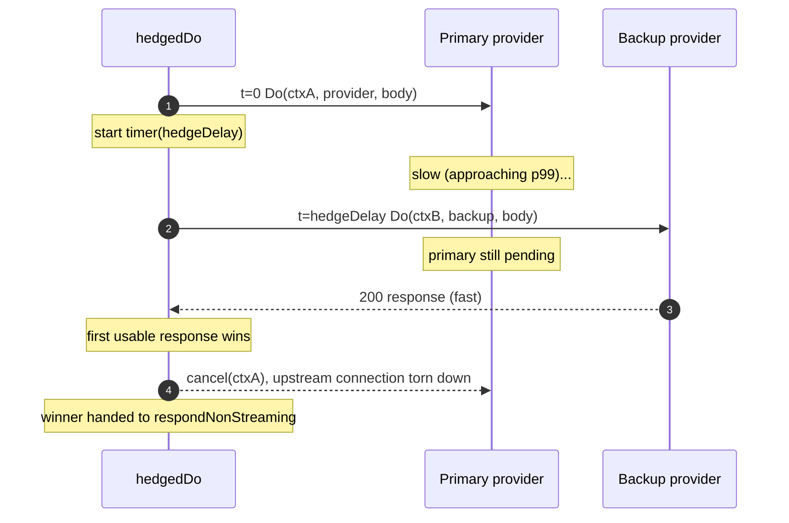
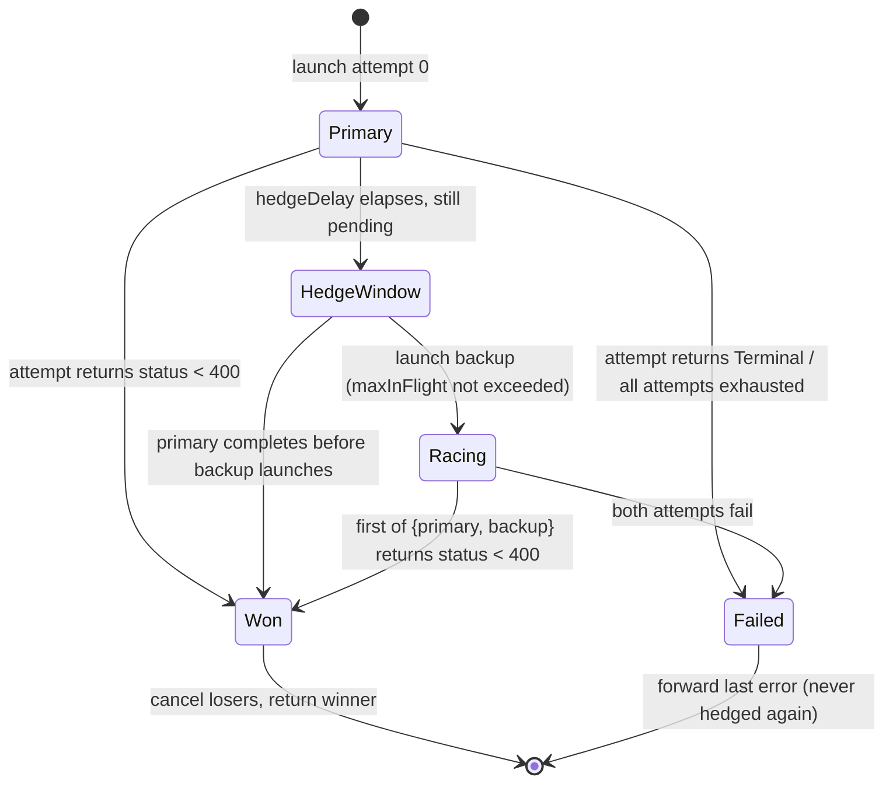
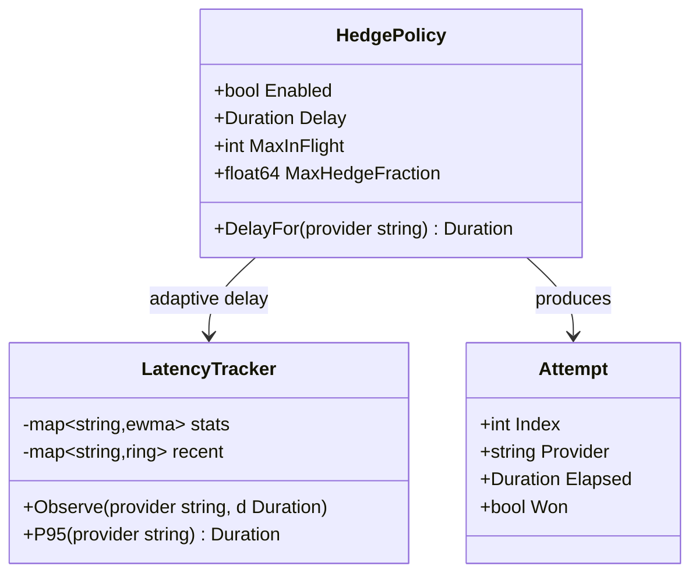

# 03 — Request hedging / speculative retries

> Race a delayed **backup** attempt against a slow-but-alive upstream, take the
> first success, and cancel the loser — cutting p99 without waiting out one
> provider's worst-case latency.

## Problem statement

The gateway's retry loop only reacts to *failure*. `doUpstreamWithRetry`
(`internal/gateway/messages.go:294-383`) calls `s.Upstream.Do`, and only if the
result is a `Retryable` status/transport error does it sleep and try again. A
request that is *slow but healthy* — a provider mid-degradation, a long
time-to-first-token, a congested region — is never hedged: the caller waits the
full latency, and the gateway's p99 is hostage to each provider's worst case.
Request hedging (a.k.a. speculative retries, Google's "tail at scale") fires a
second identical attempt once the first crosses a latency threshold and returns
whichever finishes first — a technique that cut p99 by ~74% in a real Go service
([InfoQ](https://www.infoq.com/articles/adaptive-hedged-requests-p99-latency/),
[dev.to](https://dev.to/onurcinar/beating-tail-latency-a-guide-to-request-hedging-in-go-microservices-p81)).

## Why it matters here (grounded)

- **The retry loop is strictly sequential and failure-triggered.**
  `doUpstreamWithRetry` never issues a second attempt while the first is still
  in flight — the only path to a second `s.Upstream.Do` is *after* the first has
  already returned an error (`internal/gateway/messages.go:334-366`). Slow ≠
  failed, so slow is never mitigated.
- **The cancellation primitive is already threaded correctly.** `handleMessages`
  passes `c.Request.Context()` (or a timeout-wrapped child) into the upstream
  call (`internal/gateway/messages.go:248-258`), and
  `TestClientDisconnectClosesUpstreamConnection` proves cancelling that context
  tears down the upstream connection. Hedging is "start attempt B, cancel
  whichever loses" — the exact context-cancellation mechanics already in place.
- **The cross-provider target list already exists, unused.**
  `router.BuildExecutionPlan` / `NextFallbackProvider`
  (`internal/router/fallback.go:176-232`) compute an ordered, de-duplicated
  provider/model chain — precisely the set a hedge should draw its backup from,
  and today wired into nothing.
- **The `Upstream` seam is hedge-friendly.** `Server.Upstream.Do(ctx, provider,
  body)` (`internal/gateway/messages.go:48-50`) is a clean function to invoke N
  times concurrently against different providers with different child contexts.

## Design overview

Add a **hedged execution** mode that wraps (does not replace) `doUpstreamWithRetry`
for the **non-streaming** path first. After `hedgeDelay`, if the primary attempt
has not produced a usable response, fire a backup attempt (same provider, or the
next one from the fallback chain) with its own child context; the first success
wins and every other in-flight attempt is cancelled.

Two subtleties the research flags, both handled:

1. **Header-vs-first-token.** Inference servers commonly send `200 OK` headers
   *before* the first token, so hedging on header receipt never fires
   ([TianPan](https://tianpan.co/blog/2026-05-02-tail-tolerant-retry-policy-llm-gateway-latency-cliff)).
   Non-streaming buffers the whole body, so "usable response" = full body read —
   the honest signal. (Streaming hedging, Phase 3, must instead measure
   time-to-first-*byte-of-content*, not header.)
2. **Cost.** Every hedge that doesn't get cancelled in time is duplicate tokens.
   Hedging is scoped to the slow tail only (fire at ~p95, not eagerly), bounded
   to ≤2 in-flight, and guarded by a token budget (ties into Theme 05).

Hedging respects the same **never-corrupt-an-in-flight-stream** invariant the
retry loop upholds: the winner is only handed to the response encoder after all
racing is resolved (`messages.go:307-317`).

## Phases → Tasks → Sub-tasks

### Phase 1 — Fixed-delay single-provider hedge (non-streaming, opt-in)

- **Task 1.1 — `hedgedDo` in `internal/gateway`**
  - 1.1.1 Signature mirrors `doUpstreamWithRetry`: `(c, ctx, provider, body)`,
    returns `(*http.Response, bool)`.
  - 1.1.2 Launch attempt 0; on `hedgeDelay` elapsed with no result, launch
    attempt 1; first `status < 400` wins.
  - 1.1.3 Cancel losers via per-attempt `context.WithCancel`; drain+close their
    bodies (reusing the discard pattern at `messages.go:358-359`).
- **Task 1.2 — Gate + config**
  - 1.2.1 Only when `in.Stream == false` and hedging enabled for the request's
    class; otherwise fall straight through to `doUpstreamWithRetry`.
  - 1.2.2 `Options.Hedge{Enabled bool; Delay time.Duration; MaxInFlight int}`.
- **Task 1.3 — Interaction with the retry loop**
  - 1.3.1 Each hedged attempt is itself a *single* `s.Upstream.Do`; a `Terminal`
    result from an attempt cancels the race and is forwarded (never hedged —
    a 401 hedged is a second guaranteed 401).
  - 1.3.2 Emit `X-CCR-Hedge: fired|primary` for observability (Theme 04).

### Phase 2 — Adaptive delay + cross-provider hedge

- **Task 2.1 — Per-provider latency tracker**
  - 2.1.1 EWMA + a small ring buffer of recent completions per provider; derive
    a live p95 estimate.
  - 2.1.2 `hedgeDelay = clamp(providerP95, floor, ceiling)` — adaptive, not
    fixed ([adaptive hedging](https://www.infoq.com/articles/adaptive-hedged-requests-p99-latency/)).
- **Task 2.2 — Backup target = next in the fallback chain**
  - 2.2.1 Build the chain with `router.BuildExecutionPlan`; the hedge's backup
    attempt uses `router.NextFallbackProvider` to pick a *different* provider,
    so a whole-provider slowdown is escaped, not just re-hit.
- **Task 2.3 — Hedge-rate cap**: never let hedges exceed a configured fraction
  of traffic (protects upstream quota); shed to primary-only when saturated.

### Phase 3 — Streaming hedge + cost accounting

- **Task 3.1 — Time-to-first-content hedge**: for streaming, measure the delay
  until the first non-empty content delta (not the `200` header); hedge the
  stream *before* any bytes are relayed to the client, so the losing stream is
  discarded cleanly and the winner starts `streamAnthropicSSE` — preserving the
  no-mid-stream-switch invariant.
- **Task 3.2 — Token-cost accounting**: record duplicated tokens from fired
  hedges; expose "tokens spent on hedging vs. p99 saved" so the tradeoff is
  measurable and tunable.
- **Task 3.3 — Hedge budget guard**: integrate with Theme 05's token budget so
  hedging backs off automatically when a provider is near its TPM ceiling.

## Micro-POC

`hedgedDo` against the real `Upstream` seam
(`Do(ctx, config.Provider, []byte) (*http.Response, error)`), showing the race +
cancel-loser mechanics. Elides the per-provider variation (Phase 2) for clarity.

```go
// internal/gateway/hedge.go  (sketch — Phase 1 core)
package gateway

import (
	"context"
	"net/http"
	"time"

	"github.com/vasic-digital/claude-code-router/internal/config"
)

type attemptResult struct {
	resp *http.Response
	err  error
}

// hedgedDo issues a primary attempt, and if it has not returned a usable
// (status < 400) response within delay, a backup attempt. The first usable
// response wins; all other in-flight attempts are cancelled. Falls back to a
// single attempt when delay <= 0 or maxInFlight < 2.
//
// Non-streaming only: "usable" here means the upstream returned response
// headers with status < 400; the caller (respondNonStreaming) then buffers the
// body. Phase 3 replaces the header signal with time-to-first-content for the
// streaming path.
func (s *Server) hedgedDo(
	ctx context.Context, provider config.Provider, body []byte,
	delay time.Duration, maxInFlight int,
) (*http.Response, error) {
	results := make(chan attemptResult, maxInFlight)
	var cancels []context.CancelFunc
	defer func() {
		for _, cancel := range cancels {
			cancel()
		}
	}()

	launch := func() {
		aCtx, cancel := context.WithCancel(ctx)
		cancels = append(cancels, cancel)
		go func() {
			resp, err := s.Upstream.Do(aCtx, provider, body) // real seam, messages.go:48
			results <- attemptResult{resp, err}
		}()
	}

	launch() // primary
	timer := time.NewTimer(delay)
	defer timer.Stop()

	inFlight := 1
	for {
		select {
		case <-timer.C:
			if inFlight < maxInFlight {
				launch() // backup
				inFlight++
			}
		case r := <-results:
			if r.err == nil && r.resp.StatusCode < 400 {
				return r.resp, nil // winner; deferred cancels kill the losers
			}
			// A failed/terminal attempt: drain a retryable slot, or give up.
			inFlight--
			if inFlight == 0 {
				return r.resp, r.err // last attempt's outcome is the answer
			}
		case <-ctx.Done():
			return nil, ctx.Err()
		}
	}
}
```

### Shell demo of the payoff (against a deliberately slow provider)

```bash
# With a fake upstream that sleeps 8s on the primary but 300ms on the backup,
# p99 collapses from ~8s (no hedge) to ~ (hedgeDelay + 300ms) once hedging is on.
CCR_HEDGE_ENABLED=1 CCR_HEDGE_DELAY=2s ccr serve &
time curl -s localhost:3456/v1/messages -d @slow_request.json  # ~2.3s, not ~8s
```

## Diagrams

### Hedged request timeline



### Hedge controller state machine



## Data definitions

In-memory latency tracking (Phase 2), plus an optional persisted percentile
history that feeds the adaptive delay across restarts.



```sql
-- Optional: persisted per-provider latency percentiles so the adaptive hedge
-- delay (Phase 2) survives a restart instead of re-learning from cold. One row
-- per provider per hour bucket. No request content, no credentials.
CREATE TABLE IF NOT EXISTS provider_latency (
    provider_name TEXT    NOT NULL,
    bucket_hour   INTEGER NOT NULL,          -- unix hour
    samples       INTEGER NOT NULL DEFAULT 0,
    p50_ms        INTEGER NOT NULL DEFAULT 0,
    p95_ms        INTEGER NOT NULL DEFAULT 0,
    p99_ms        INTEGER NOT NULL DEFAULT 0,
    hedges_fired  INTEGER NOT NULL DEFAULT 0,
    hedges_won    INTEGER NOT NULL DEFAULT 0, -- backup beat primary
    PRIMARY KEY (provider_name, bucket_hour)
);
```

## Acceptance criteria

- **Phase 1**: with a primary that stalls past `hedgeDelay` and a fast backup,
  wall-clock latency ≈ `hedgeDelay + backup_latency`, not primary latency; the
  losing attempt's upstream connection is provably cancelled (a
  `TestClientDisconnectClosesUpstreamConnection`-style test on the loser); a
  `Terminal` primary is forwarded without hedging; hedging off ⇒ byte-identical
  to today.
- **Phase 2**: `hedgeDelay` tracks each provider's measured p95; the backup
  attempt targets a *different* provider from the fallback chain; hedge rate
  stays under the configured cap under load.
- **Phase 3**: streaming hedges fire on first-content latency, never mid-stream;
  duplicated-token cost is reported.

## Risks & backward-compatibility

- **Duplicated cost.** A hedge that isn't cancelled in time is paid twice.
  Mitigation: fire only at the slow tail (p95+), cap in-flight at 2, cap hedge
  *rate*, and expose the token cost so operators can tune (or disable).
- **Non-idempotent side effects.** LLM generations are effectively idempotent
  for read-style turns, but tool-executing turns are not. Mitigation: Phase 1 is
  scoped to non-streaming, non-tool requests; hedging tool turns is an explicit
  later opt-in, never a default.
- **Thundering herd on a struggling provider.** Hedging a provider that is slow
  *because* it is overloaded can worsen it. Mitigation: Phase 2's cross-provider
  backup sends the hedge *elsewhere*, and Theme 05's circuit breaker/health
  score suppresses hedging toward an unhealthy provider.
- **Backward-compat**: `Options.Hedge.Enabled` defaults false; when off,
  `handleMessages` calls `doUpstreamWithRetry` exactly as it does today. No
  config, route, or wire change for existing installs.
