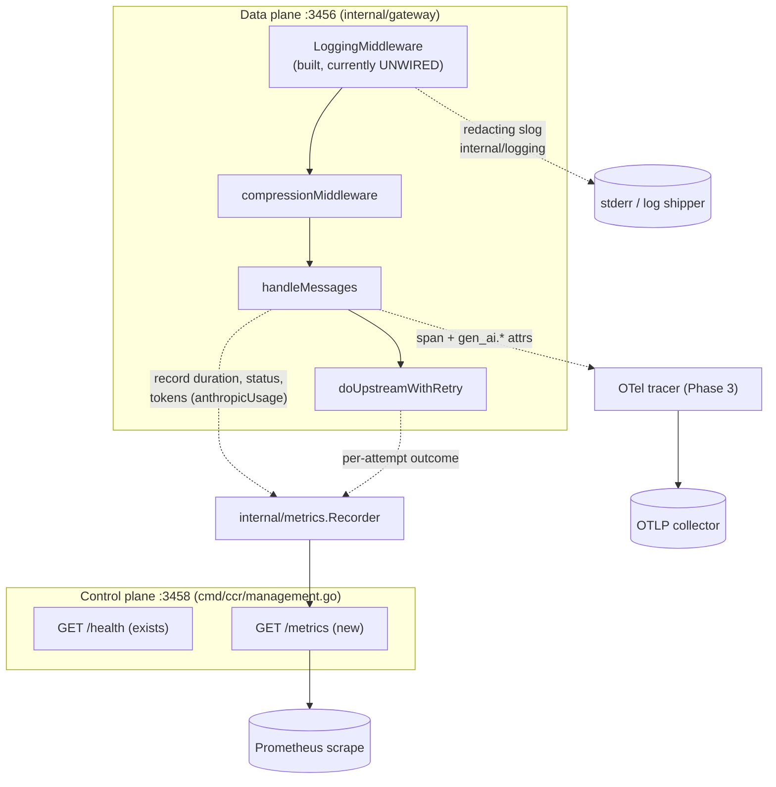
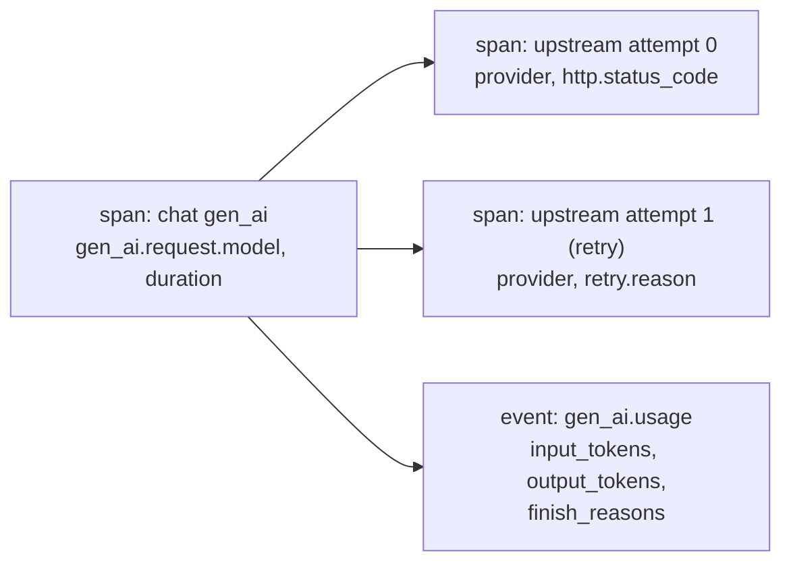
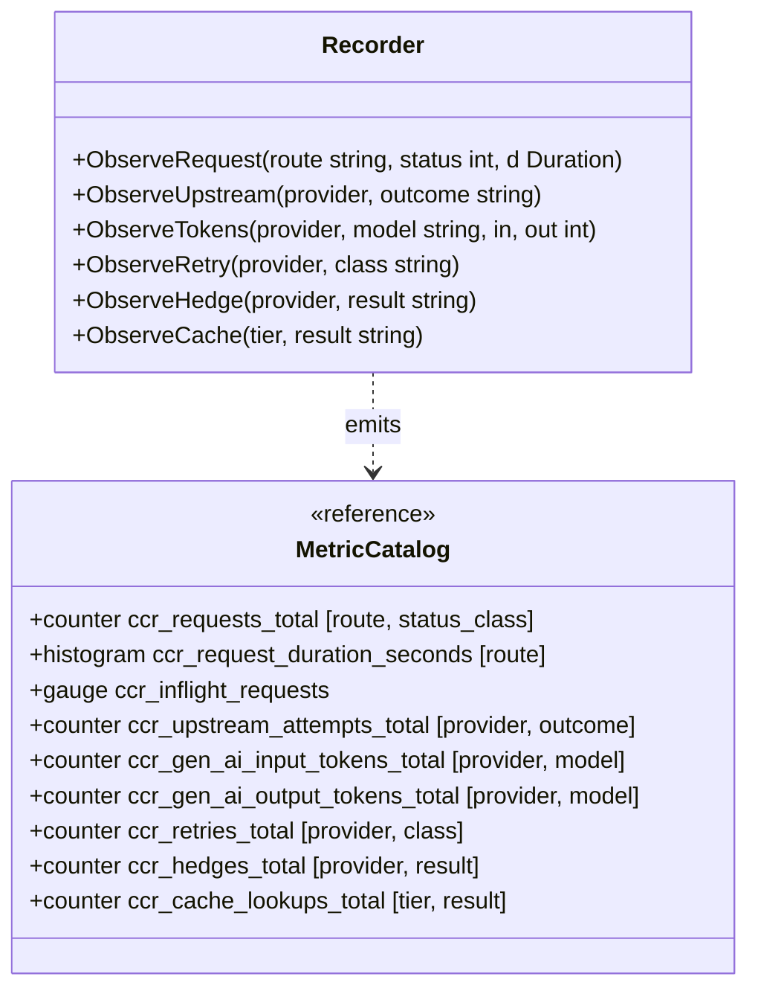

# 04 — Observability & metrics

> Turn on the redacting access logger that is **already built but never wired**,
> add a Prometheus `/metrics` endpoint with RED + GenAI-token metrics, then
> OpenTelemetry tracing on the GenAI semantic conventions.

## Problem statement

The gateway is effectively blind in production. There is no request log, no
metrics endpoint, no trace — an operator cannot answer "what is my p99?",
"which provider is erroring?", "how many tokens did I burn today?", or "why was
*that* request slow?". The striking part: the hard pieces already exist in the
tree and are simply not connected. `internal/logging` is a complete redacting
`slog` layer, and `internal/gateway/logging_middleware.go` is a complete
per-request access-log middleware — both fully written, both wired into nothing.
`docs/ARCHITECTURE.md` states it plainly: logging is *"PLANNED — not called from
any package yet"* and the component graph draws it as a dashed, unconnected node.

## Why it matters here (grounded)

- **`LoggingMiddleware` is built and unused.**
  `internal/gateway/logging_middleware.go:63-101` is a finished gin middleware
  that logs method/path/status/duration/bytes/request-id and echoes
  `X-Request-Id` — but nothing calls `s.eng.Use(LoggingMiddleware(...))`. Its
  own header comment says wiring it into `gateway.go` is "left to whichever
  agent owns that file."
- **The redaction layer is built and unused.** `internal/logging/redact.go`
  scrubs `api_key`/`authorization`/`bearer`/`sk-…`/`github_pat_…` from both
  attribute keys and free-text — so structured logging is *safe by construction*
  the moment it's turned on. The one subtlety is already handled:
  `newRequestID` emits a hyphenated UUID specifically so the redactor's
  24-char-blob rule doesn't scrub the request id
  (`logging_middleware.go:103-131`).
- **There is a natural home for `/metrics`.** `cmd/ccr` already runs a second,
  minimal management HTTP server (`127.0.0.1:3458`, `cmd/ccr/management.go`,
  `cmd/ccr/serve.go:59-70`) with its own `/health` and a placeholder `/`. A
  `/metrics` handler belongs there — off the hot data-plane, on the control
  plane — and it is deliberately *not* wrapped by the compression middleware, so
  Prometheus scrapes stay plain text.
- **The token numbers are already parsed.** `respondNonStreaming` and
  `streamAnthropicSSE` already read `usage.prompt_tokens`/`completion_tokens`
  into `anthropicUsage` (`internal/gateway/messages.go:521-525`, `662-665`,
  `703-704`) — the exact inputs for `gen_ai.usage.*` metrics, currently used
  only to fill the response and then discarded.

## Design overview

Three layers, each strictly additive, following the OpenTelemetry **GenAI
semantic conventions** so the output is vendor-portable (Datadog, Grafana, etc.
already ingest these) ([OTel GenAI](https://opentelemetry.io/blog/2026/genai-observability/),
[semconv registry](https://opentelemetry.io/docs/specs/semconv/registry/attributes/gen-ai/)):

1. **Structured access logs** — wire the existing `LoggingMiddleware` + a
   `logging.New` logger into the gateway and the CLI. Near-zero code, immediate
   value.
2. **Prometheus metrics** — a small `internal/metrics` registry; RED (Rate,
   Errors, Duration) per route + provider, plus GenAI token counters and retry/
   hedge/cache counters from the other themes; exposed on the management server.
3. **OpenTelemetry tracing** — a span per request and per upstream attempt,
   attributed with `gen_ai.request.model`, `gen_ai.usage.input_tokens`, etc.;
   optional, exporter configured from env.

Every layer inherits the redaction guarantee: metric **labels** are bounded,
low-cardinality, secret-free (provider *name*, model, status class — never a
key, never a raw model id with embedded creds).

## Phases → Tasks → Sub-tasks

### Phase 1 — Wire the logger (the highest value-to-effort item in the dossier)

- **Task 1.1 — Install `LoggingMiddleware`**
  - 1.1.1 In `gateway.go` `routes()`, add `s.eng.Use(LoggingMiddleware(s.log))`
    ahead of the compression middleware, with `s.log` a `logging.New`-built
    logger stored on `Server`.
  - 1.1.2 Confirm `/health`/`/ready` still succeed and now emit one log line
    each (they should — the middleware is body-agnostic).
- **Task 1.2 — Construct the logger in the CLI**
  - 1.2.1 `cmd/ccr/serve.go` builds `logging.New(os.Stderr)` (env-configured via
    `CCR_LOG_LEVEL`/`CCR_LOG_FORMAT`, `logging.go:36-39`) and passes it into
    `gateway.New`/an option.
  - 1.2.2 Log gateway lifecycle events (listen, shutdown) through it.
- **Task 1.3 — Log upstream attempts** inside `doUpstreamWithRetry`: one line
  per attempt (provider name, status, retry class, backoff) — the first real
  visibility into retries. All through the redacting logger, so a provider error
  body that quotes a key is scrubbed automatically.

### Phase 2 — Prometheus metrics

- **Task 2.1 — `internal/metrics` registry**
  - 2.1.1 Add `github.com/prometheus/client_golang` (the one new dep; standard,
    widely-audited).
  - 2.1.2 Define the metric set (see Data definitions): request counter, duration
    histogram, in-flight gauge, upstream-attempt counter, token counters,
    retry/hedge/cache counters.
- **Task 2.2 — Instrument the data plane**
  - 2.2.1 A thin recorder called from `handleMessages` (start/stop timing,
    status class) and `doUpstreamWithRetry` (per-attempt outcome).
  - 2.2.2 Token counters fed from the `anthropicUsage` already parsed in the
    response encoders.
- **Task 2.3 — Expose on the management server**
  - 2.3.1 Register `promhttp.Handler()` at `GET /metrics` in
    `cmd/ccr/management.go` (plain text, no compression, control-plane only).
  - 2.3.2 Bind loopback by default (same posture as `/health`).

### Phase 3 — OpenTelemetry tracing (GenAI semconv)

- **Task 3.1 — Tracer bootstrap** from env (`OTEL_EXPORTER_OTLP_ENDPOINT`);
  no-op tracer when unset, so tracing is zero-cost off.
- **Task 3.2 — Span topology**: root span `chat gen_ai` per `/v1/messages`; child
  span per upstream attempt; events for retry/hedge decisions.
- **Task 3.3 — GenAI attributes**: `gen_ai.request.model`,
  `gen_ai.response.model`, `gen_ai.usage.input_tokens`,
  `gen_ai.usage.output_tokens`, `gen_ai.response.finish_reasons`, plus the
  `gen_ai.client.operation.duration` / `gen_ai.client.token.usage` histograms
  ([Greptime GenAI semconv](https://greptime.com/blogs/2026-05-09-opentelemetry-genai-semantic-conventions)).
  **Never** attach prompt/response *content* by default (privacy) — attributes
  only.

## Micro-POC

Phase 1 is almost entirely deletion of the gap — the wiring is two lines against
existing code:

```go
// internal/gateway/gateway.go  routes()  (sketch — Phase 1 wiring)
func (s *Server) routes() {
	s.eng.Use(LoggingMiddleware(s.log)) // s.log built via logging.New; nil ⇒ its own default
	s.eng.Use(compressionMiddleware())  // existing, unchanged
	// ... existing /health, /ready, POST /v1/messages ...
}
```

Phase 2 recorder, using the token numbers `handleMessages` already has:

```go
// internal/metrics/metrics.go  (sketch — Phase 2)
package metrics

import (
	"strconv"

	"github.com/prometheus/client_golang/prometheus"
	"github.com/prometheus/client_golang/prometheus/promauto"
)

type Recorder struct {
	requests   *prometheus.CounterVec   // by route, status_class
	duration   *prometheus.HistogramVec // by route
	upstream   *prometheus.CounterVec   // by provider, outcome (ok/retry/terminal)
	inTokens   *prometheus.CounterVec   // by provider, model  → gen_ai.usage.input_tokens
	outTokens  *prometheus.CounterVec   // by provider, model  → gen_ai.usage.output_tokens
}

func New(reg prometheus.Registerer) *Recorder {
	f := promauto.With(reg)
	return &Recorder{
		requests: f.NewCounterVec(prometheus.CounterOpts{
			Name: "ccr_requests_total", Help: "Requests by route and status class.",
		}, []string{"route", "status_class"}),
		duration: f.NewHistogramVec(prometheus.HistogramOpts{
			Name:    "ccr_request_duration_seconds",
			Help:    "Request duration by route.",
			Buckets: prometheus.DefBuckets,
		}, []string{"route"}),
		upstream: f.NewCounterVec(prometheus.CounterOpts{
			Name: "ccr_upstream_attempts_total", Help: "Upstream attempts by provider and outcome.",
		}, []string{"provider", "outcome"}),
		inTokens: f.NewCounterVec(prometheus.CounterOpts{
			Name: "ccr_gen_ai_input_tokens_total", Help: "gen_ai.usage.input_tokens.",
		}, []string{"provider", "model"}),
		outTokens: f.NewCounterVec(prometheus.CounterOpts{
			Name: "ccr_gen_ai_output_tokens_total", Help: "gen_ai.usage.output_tokens.",
		}, []string{"provider", "model"}),
	}
}

// ObserveTokens is fed from the anthropicUsage already parsed at
// messages.go:521-525 / 703-704 — currently discarded after filling the response.
func (r *Recorder) ObserveTokens(provider, model string, in, out int) {
	r.inTokens.WithLabelValues(provider, model).Add(float64(in))
	r.outTokens.WithLabelValues(provider, model).Add(float64(out))
}

func statusClass(code int) string { return strconv.Itoa(code/100) + "xx" }
```

Expose on the management server (`cmd/ccr/management.go`, alongside `/health`):

```go
// (sketch) management server route addition
mux.Handle("/metrics", promhttp.HandlerFor(reg, promhttp.HandlerOpts{}))
```

### Shell demo

```bash
ccr serve &
curl -s localhost:3456/v1/messages -d @req.json >/dev/null
curl -s localhost:3458/metrics | grep ccr_
# ccr_requests_total{route="/v1/messages",status_class="2xx"} 1
# ccr_gen_ai_input_tokens_total{provider="deepseek",model="deepseek-chat"} 1234
# ccr_gen_ai_output_tokens_total{provider="deepseek",model="deepseek-chat"} 567

CCR_LOG_FORMAT=text ccr serve
# ... http_request method=POST path=/v1/messages status=200 duration_ms=812 \
#     bytes=2048 request_id=550e8400-e29b-41d4-a716-446655440000
```

## Diagrams

### Observability wiring (all three layers)



### GenAI span topology (Phase 3)



## Data definitions

Observability state is metrics and traces, not rows — so the "schema" is the
metric/attribute catalog. No SQL is natural here; the structural model is the
recorder and the label/attribute sets.



**GenAI semantic-convention attribute mapping** (Phase 3 spans):

| Gateway value | OTel GenAI attribute | Source in code |
|---|---|---|
| routed model | `gen_ai.request.model` | `router.Select` result |
| provider system | `gen_ai.system` | `config.Provider.Name` |
| prompt tokens | `gen_ai.usage.input_tokens` | `anthropicUsage.InputTokens` (`messages.go:521`) |
| completion tokens | `gen_ai.usage.output_tokens` | `anthropicUsage.OutputTokens` |
| stop reason | `gen_ai.response.finish_reasons` | `mapFinishReason` (`messages.go:173`) |
| latency histogram | `gen_ai.client.operation.duration` | request timing |

## Acceptance criteria

- **Phase 1**: every request produces exactly one structured log line with a
  request id echoed as `X-Request-Id`; a log line that would contain a key
  (e.g. an upstream error quoting `Authorization: Bearer sk-…`) shows
  `[REDACTED]` (asserted against `redact_test.go`'s guarantees); `/health` and
  `/ready` still pass and log.
- **Phase 2**: `GET :3458/metrics` returns valid Prometheus text with `ccr_*`
  series; token counters match the `usage` in the corresponding responses;
  labels are bounded (no raw key, no unbounded model string) — a cardinality
  test caps label values.
- **Phase 3**: with an OTLP endpoint set, each request emits a root span with
  `gen_ai.*` attributes and a child span per upstream attempt; with the endpoint
  unset, the tracer is a no-op and adds no measurable latency; no span carries
  prompt/response content by default.

## Risks & backward-compatibility

- **Label cardinality explosion.** A naive `model` label taken from a raw
  client-supplied id (which can embed selectors/creds) is both a cardinality and
  a leak risk. Mitigation: label with the *resolved* model + provider *name*
  only, and pass all label strings through a bounded allow-set; secret-shaped
  values are already scrubbed by the logging layer for log paths.
- **Performance overhead on the hot path.** Mitigation: metrics are lock-free
  atomic counters (client_golang); logging is one line per request; tracing is a
  no-op tracer when unconfigured. All measured against the existing bench suite.
- **New dependency (`client_golang`, later OTel SDK).** Called out explicitly;
  both are standard, and Phase 1 (the biggest immediate win) adds **zero**
  dependencies — it only wires code already in the tree.
- **Content privacy.** Never log or trace prompt/response bodies by default;
  `logging_middleware.go` already refuses to read bodies, and the GenAI-content
  span attributes are opt-in only.
- **Backward-compat**: logs go to stderr (stdout stays free for CLI output, per
  `logging.go:98-101`); `/metrics` is a new control-plane route; nothing on the
  data plane's wire behaviour changes.
