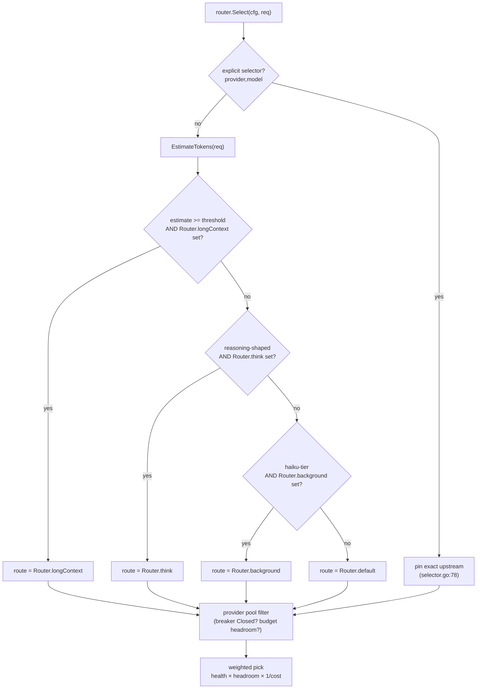
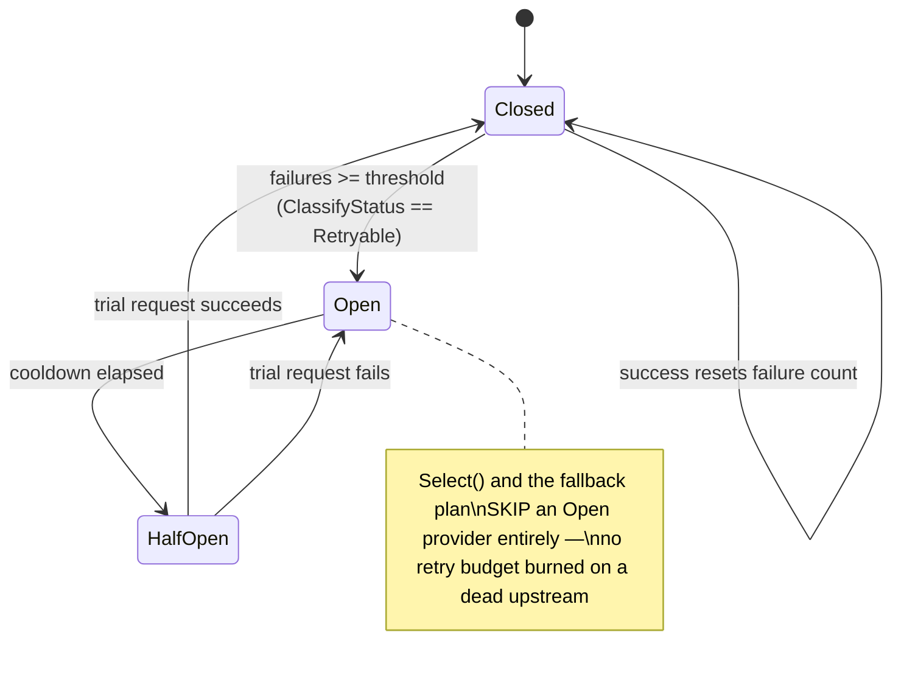
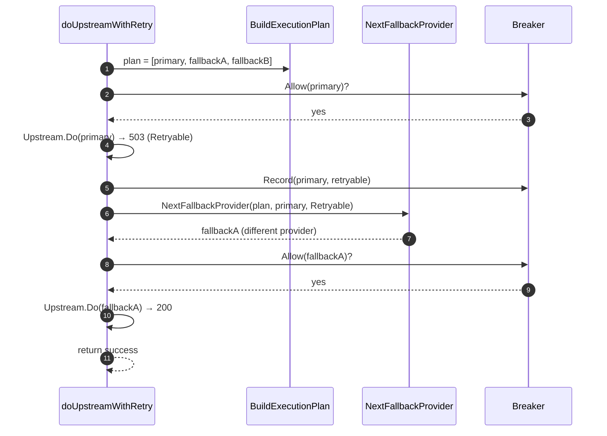
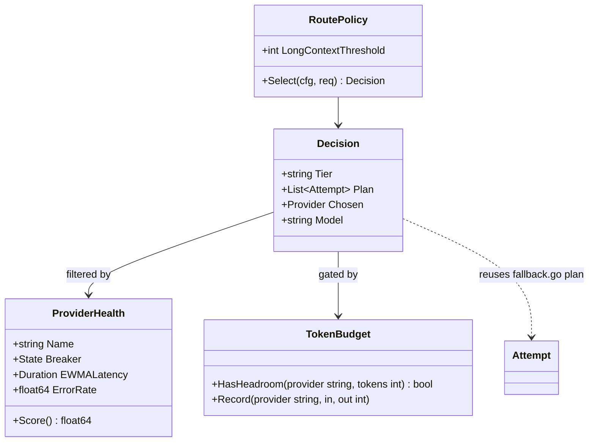

# 05 — Adaptive provider routing

> Consume the `Think`/`LongContext` route fields the config already validates,
> wire the cross-provider fallback chain the router already computes, and add
> circuit breakers + token-budget-aware weighted load balancing on top.

## Problem statement

Routing today is a static, two-branch decision made once per request, against a
single provider, with no awareness of provider health, load, cost, or the
request's own size. `router.Select` picks an explicit selector, else haiku →
`Router.Background`, else `Router.Default`, else the first provider
(`internal/router/router.go:45-79`). Once chosen, the request is bound to that
one provider: the retry loop re-hits the *same* provider
(`internal/gateway/messages.go:334-366`) and gives up when its budget is
exhausted — even when a perfectly healthy sibling provider could serve the same
model. Two route dimensions (`Think`, `LongContext`) are parsed and validated but
never used, and a large context request can be sent to a small-context model.
This is the single biggest behavioural gap the porting matrix calls out
(`test/PORTING-MATRIX.md` §"Prioritised GAP summary" #1).

## Why it matters here (grounded)

- **`Think`/`LongContext` are validated but dead.** `config.Route` defines all
  four fields and `Validate` checks their provider references
  (`internal/config/config.go:65-70`, `139-153`), yet `router.Select` branches
  only on `Default`/`Background` (`internal/router/router.go:61-64`). A large or
  reasoning-heavy request has nowhere correct to go.
- **The cross-provider fallback machinery exists and is wired to nothing.**
  `BuildExecutionPlan` (de-duplicated ordered attempts) and
  `NextFallbackProvider` (advance to a *different* provider on a `Retryable`
  class, stop on `Terminal`) are complete and tested in
  `internal/router/fallback.go:176-232` — but `doUpstreamWithRetry` never calls
  them. It loops on one provider. `docs/ARCHITECTURE.md` even notes the retry
  loop drives the *classification* policy but not the *execution plan*.
- **No health signal feeds routing.** There is no circuit breaker, no error-rate
  tracking, no latency score. A provider that is down still gets picked and
  burns the whole retry budget every request.
- **No token/rate budgeting.** Providers impose RPM/TPM limits and charge per
  token; the gateway models neither, so it cannot avoid a provider that is at its
  ceiling or prefer a cheaper equivalent — the core of token-budget-aware load
  balancing ([TrueFoundry](https://www.truefoundry.com/blog/rate-limiting-in-llm-gateway),
  [Collabnix](https://collabnix.com/llm-gateway-patterns-rate-limiting-and-load-balancing-guide/)).

## Design overview

Three additive layers, each a strict superset of today's behaviour when its
config is absent:

1. **Tier-aware routing** — estimate the request's token size and shape, and
   consume `LongContext` (over a size threshold) and `Think` (reasoning-shaped)
   so `router.Select` returns the intended tier. Pure function change, no new
   state.
2. **Health-aware cross-provider fallback** — drive `doUpstreamWithRetry` off
   `BuildExecutionPlan`, advancing to the *next provider* via
   `NextFallbackProvider` on retryable/exhausted failures, gated by a per-provider
   **circuit breaker** so a down provider is skipped, not re-hit.
3. **Token-budget-aware weighted load balancing** — model each provider's
   RPM/TPM window and cost, treat equivalent providers as a weighted pool, and
   pick by a live score (health × headroom × inverse-cost). Persist the windows.

The design keeps `router.Select` as the single decision seam and threads a
richer *plan* (not just a pair) into the gateway's retry loop — reusing the
`Attempt`/plan types already in `fallback.go`.

## Phases → Tasks → Sub-tasks

### Phase 1 — Consume `Think` / `LongContext`

- **Task 1.1 — Token estimator**
  - 1.1.1 `EstimateTokens(req *AnthropicRequest) int` — a fast heuristic (chars/4
    over system + messages, plus a per-tool overhead). No tokenizer dependency;
    a documented approximation, refined later.
  - 1.1.2 Property test: monotonic in message length; stable.
- **Task 1.2 — Route-tier selection in `router.Select`**
  - 1.2.1 New branch order: explicit selector → `LongContext` when estimate ≥
    `LongContextThreshold` → `Think` when the request is reasoning-shaped (e.g.
    `thinking`-hinted or a configured trigger) → haiku → `Background` → `Default`.
  - 1.2.2 Each new tier is skipped when its route string is empty — so a config
    without `LongContext`/`Think` behaves exactly as today.
  - 1.2.3 Ported tests: extend `router_test.go` with tier cases.
- **Task 1.3 — Config surface**
  - 1.3.1 Optional `Router.LongContextThreshold` (tokens); default a sane
    constant so an operator who only sets `Router.longContext` still benefits.

### Phase 2 — Health-aware cross-provider fallback + circuit breaker

- **Task 2.1 — Thread the execution plan into the retry loop**
  - 2.1.1 At route time, build the plan from the primary + configured fallbacks
    (`BuildExecutionPlan`).
  - 2.1.2 In `doUpstreamWithRetry`, on a `Retryable`/exhausted outcome, call
    `NextFallbackProvider` to move to a *different* provider before re-trying;
    keep the `Terminal`-never-retried invariant.
- **Task 2.2 — Per-provider circuit breaker**
  - 2.2.1 `internal/router` (or a new `internal/health`) breaker: closed →
    open (after an error-rate/threshold trip) → half-open (probe) → closed.
  - 2.2.2 `Select`/the plan skips `open` providers; a half-open provider gets a
    single trial request.
  - 2.2.3 Feed the breaker from `router.ClassifyStatus`/`ClassifyTransportError`
    (`fallback.go:82-116`) results already produced per attempt.
- **Task 2.3 — Health score**: EWMA latency + rolling error rate per provider,
  surfaced to metrics (Theme 04) and used to *order* equivalent fallbacks.

### Phase 3 — Token-budget-aware weighted load balancing

- **Task 3.1 — RPM/TPM windows**: sliding-window counters per provider
  (requests + prompt/completion tokens), fed from the usage the response
  encoders already parse (`messages.go:521-525`).
- **Task 3.2 — Provider pool + weighted pick**: group providers serving an
  equivalent model into a pool; pick by score = `health × tokenHeadroom ×
  (1/relativeCost) × weight`, skipping any provider over its TPM/RPM ceiling.
- **Task 3.3 — Hard per-request caps**: enforce a max-context / max-output guard
  so one 200k-token request cannot blow a provider's budget
  ([Hivenet](https://www.hivenet.com/post/llm-rate-limiting-quotas)); reject or
  down-route oversize requests deterministically.
- **Task 3.4 — Persistence**: store routing decisions, health, and budget windows
  (DDL below) for the management UI and cross-restart warm start.

## Micro-POC

Token estimate + tier selection, extending the real `router.Select` shape
(`Select(cfg, req) (*config.Provider, string, error)`), and a circuit-breaker
skeleton.

```go
// internal/router/tier.go  (sketch — Phase 1)
package router

import "github.com/vasic-digital/claude-code-router/internal/translate"

// DefaultLongContextThreshold: requests estimated at or above this many tokens
// prefer Router.LongContext when it is configured.
const DefaultLongContextThreshold = 60000

// EstimateTokens is a fast, dependency-free approximation (~4 chars/token) over
// the fields translate.AnthropicRequest actually carries. Deliberately an
// estimate, not a tokenizer: it only has to be good enough to pick a tier.
func EstimateTokens(req *translate.AnthropicRequest) int {
	if req == nil {
		return 0
	}
	chars := len(req.System)
	for _, m := range req.Messages {
		chars += len(m.Content) // RawMessage length is a fine proxy
	}
	for _, t := range req.Tools {
		chars += len(t.InputSchema) + len(t.Description)
	}
	return chars / 4
}

// selectTier returns the route string for a request, honouring LongContext/Think
// when configured and non-empty, else falling through to today's haiku/Default
// logic. An empty tier route is skipped, so a config without these tiers behaves
// exactly as router.Select does today.
func selectTier(cfg *config.Config, req *translate.AnthropicRequest, threshold int) string {
	if req != nil && cfg.Router.LongContext != "" && EstimateTokens(req) >= threshold {
		return cfg.Router.LongContext
	}
	if req != nil && cfg.Router.Think != "" && isReasoningShaped(req) {
		return cfg.Router.Think
	}
	if req != nil && isHaikuTier(req.Model) && cfg.Router.Background != "" {
		return cfg.Router.Background
	}
	return cfg.Router.Default
}
```

```go
// internal/health/breaker.go  (sketch — Phase 2)
package health

import (
	"sync"
	"time"
)

type State int

const (
	Closed   State = iota // healthy: allow
	Open                  // tripped: skip
	HalfOpen              // probing: allow one trial
)

type Breaker struct {
	mu           sync.Mutex
	state        State
	failures     int
	threshold    int
	openUntil    time.Time
	cooldown     time.Duration
}

// Allow reports whether a request to this provider may proceed now.
func (b *Breaker) Allow() bool {
	b.mu.Lock()
	defer b.mu.Unlock()
	if b.state == Open && time.Now().After(b.openUntil) {
		b.state = HalfOpen // one trial request may probe recovery
	}
	return b.state != Open
}

// Record folds one attempt outcome (from router.ClassifyStatus /
// ClassifyTransportError) into the breaker state.
func (b *Breaker) Record(retryable bool) {
	b.mu.Lock()
	defer b.mu.Unlock()
	if retryable {
		b.failures++
		if b.failures >= b.threshold {
			b.state, b.openUntil = Open, time.Now().Add(b.cooldown)
		}
		return
	}
	b.failures, b.state = 0, Closed // a clean success closes the breaker
}
```

## Diagrams

### Tier-aware routing decision



### Circuit breaker state machine



### Cross-provider fallback (wiring the built-but-unused plan)



## Data definitions (SQL DDL — Phase 3.4)

```sql
-- Rolling per-provider health, feeding the weighted pick and the breaker's
-- warm start after a restart. No request content, no credentials.
CREATE TABLE IF NOT EXISTS provider_health (
    provider_name   TEXT    PRIMARY KEY,
    breaker_state   TEXT    NOT NULL DEFAULT 'closed', -- closed|open|half_open
    ewma_latency_ms INTEGER NOT NULL DEFAULT 0,
    error_rate_bps  INTEGER NOT NULL DEFAULT 0,        -- basis points (0..10000)
    consecutive_fail INTEGER NOT NULL DEFAULT 0,
    last_success_at INTEGER,                           -- unix seconds
    last_failure_at INTEGER,
    updated_at      INTEGER NOT NULL
);

-- Sliding-window token/request budgets per provider, for TPM/RPM-aware routing.
-- One row per provider per minute bucket; the pick skips a provider whose bucket
-- would exceed its configured ceiling.
CREATE TABLE IF NOT EXISTS token_budget_windows (
    provider_name  TEXT    NOT NULL,
    bucket_minute  INTEGER NOT NULL,                   -- unix minute
    requests       INTEGER NOT NULL DEFAULT 0,
    prompt_tokens  INTEGER NOT NULL DEFAULT 0,
    output_tokens  INTEGER NOT NULL DEFAULT 0,
    PRIMARY KEY (provider_name, bucket_minute)
);

CREATE INDEX IF NOT EXISTS idx_budget_provider ON token_budget_windows (provider_name, bucket_minute);

-- Audit of routing decisions for the management UI: which tier/provider/model
-- served a request, why, and how the fallback chain unfolded.
CREATE TABLE IF NOT EXISTS routing_decisions (
    id             INTEGER PRIMARY KEY AUTOINCREMENT,
    request_id     TEXT    NOT NULL,                   -- X-Request-Id (Theme 04)
    tier           TEXT    NOT NULL,                   -- default|background|think|longContext|explicit
    chosen_provider TEXT   NOT NULL,
    chosen_model   TEXT    NOT NULL,
    est_tokens     INTEGER NOT NULL DEFAULT 0,
    attempts       INTEGER NOT NULL DEFAULT 1,
    final_status   INTEGER NOT NULL DEFAULT 0,
    fallback_used  INTEGER NOT NULL DEFAULT 0,         -- 0/1
    created_at     INTEGER NOT NULL
);

CREATE INDEX IF NOT EXISTS idx_decisions_time ON routing_decisions (created_at);
```

### Routing type model



## Acceptance criteria

- **Phase 1**: a request estimated over the threshold routes to
  `Router.longContext` when set; a reasoning-shaped request routes to
  `Router.think` when set; a config with neither set routes exactly as today
  (regression golden test on `router_test.go`).
- **Phase 2**: a 503-then-200 across two providers succeeds by advancing to the
  *second* provider (asserted via the `Upstream` seam), not by re-hitting the
  first; an `open` breaker provider is skipped without an upstream call; a
  `Terminal` failure still never retries.
- **Phase 3**: a provider at its TPM ceiling is not chosen while a sibling with
  headroom is; an oversize request is capped/rejected deterministically;
  `routing_decisions` records tier + fallback for every request.

## Risks & backward-compatibility

- **Token estimation is approximate.** A char/4 heuristic can mis-tier near the
  threshold. Mitigation: it only *selects a tier*, never truncates content; the
  threshold is configurable; a real tokenizer can replace the heuristic behind
  the same function later.
- **Fallback can mask a persistent config error.** Silently sliding to provider
  B on every request hides that A is misconfigured. Mitigation: breaker
  trip/half-open transitions are logged + metered (Theme 04); `NextFallbackProvider`
  already surfaces a misconfigured fallback entry as a hard error rather than
  skipping it (`fallback.go:224-230`).
- **State adds moving parts.** Breakers and budgets are shared mutable state.
  Mitigation: keep it in-process, lock-guarded, and *advisory* — a failure of
  the health layer degrades to today's static routing, never to an outage.
- **Backward-compat**: `Think`/`LongContext` unset ⇒ those branches are skipped;
  no fallback list ⇒ the plan is a single primary and the loop behaves as today;
  breaker/budget layers are null when unconfigured. Every existing `config.json`
  routes identically.
