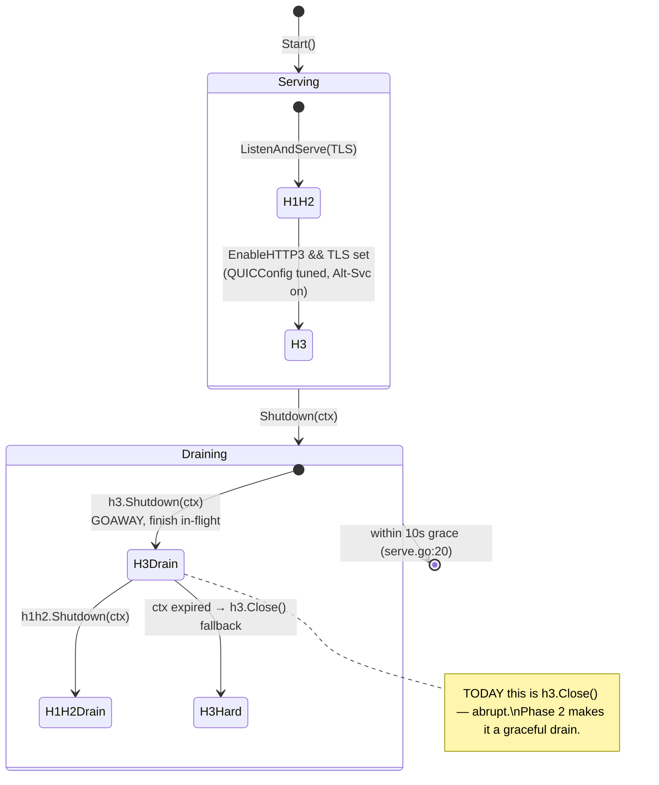
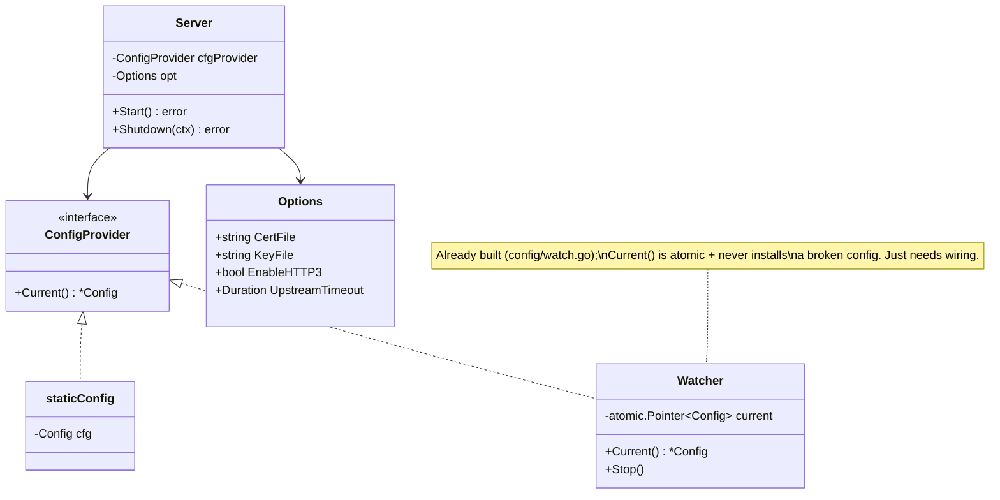

# 06 — Transport & runtime hardening

> Hot-reload config through the `Watcher` that is **already built but unused**,
> expose TLS/HTTP-3 via the CLI, drain QUIC gracefully instead of slamming it
> shut, and tune the QUIC/UDP stack for throughput.

## Problem statement

Three concrete transport/runtime gaps, each visible in the code:

1. **No config hot-reload, despite a finished `Watcher`.** `cmd/ccr/serve.go:38`
   calls `config.Load(config.Path())` exactly once at boot and holds the result
   for the process lifetime. `internal/config/watch.go` is a complete,
   poll-based, atomic-swap `Watcher` — and its own doc comment warns that *"the
   toolkit's provider-alias launcher rewrites `~/.claude-code-router/config.json`
   … on every launch, so a long-running gateway must not go blind to it"*
   (`watch.go:19-23`). It is wired into nothing.
2. **HTTP/3 and TLS are unreachable from the CLI, and HTTP/3 shutdown is
   abrupt.** `Options.CertFile/KeyFile/EnableHTTP3` exist
   (`internal/gateway/gateway.go:38-43`) but `cmd/ccr/serve.go:46` never sets
   them, so a CLI gateway is always plain HTTP (`docs/ARCHITECTURE.md` confirms
   this). And `Shutdown` closes HTTP/3 with `s.h3.Close()`
   (`internal/gateway/gateway.go:204-206`) — an abrupt close, not the graceful
   `Shutdown(ctx)` quic-go provides, which drains in-flight requests via a
   GOAWAY frame ([quic-go docs](https://quic-go.net/docs/http3/server/)).
3. **QUIC is untuned.** `Start` builds `&http3.Server{Addr, Handler}` with **no
   `QUICConfig`** (`internal/gateway/gateway.go:181`) — default receive windows,
   no explicit stream limits, no 0-RTT policy, no datagram support, and no
   guidance on the UDP receive-buffer sizing QUIC is sensitive to
   ([quic-go optimizations](https://quic-go.net/docs/quic/optimizations/)).

## Why it matters here (grounded)

- **The `Watcher` API is a drop-in.** `NewWatcher(path, interval, onError)
  (*Watcher, error)` performs one synchronous `Load` (so boot still fails fast on
  a bad config) then serves `Current() *Config` to concurrent readers with an
  atomic swap that never installs a broken config (`watch.go:33-99`). The gateway
  just needs to read `Current()` per request instead of holding one `*Config`.
- **The `Server` already holds `cfg` in one place.** `Server.cfg`
  (`internal/gateway/gateway.go:73`) is read by `/ready`
  (`gateway.go:137-151`), `defaultRouter`, and the wired `routerAdapter`
  (`wiring.go:30-44`). Swapping that single field for a config *provider* is a
  contained change.
- **The flags plumbing exists.** `cmd/ccr/flags.go` already parses
  `--gateway-host`/`--gateway-port` and `CCR_GATEWAY_PORT`; TLS/HTTP-3 flags slot
  into the same parser.
- **The transport-selection state machine is already documented.**
  `docs/ARCHITECTURE.md`'s "Protocol selection" diagram maps exactly which branch
  runs; this theme adds the CLI surface to reach the HTTP/3 branch and the
  graceful-drain edge it is missing.

## Design overview

Three additive layers, each behind an opt-in flag/default that preserves today's
plain-loopback-HTTP behaviour:

1. **Config hot-reload** — replace `Server`'s fixed `*config.Config` with a
   `ConfigProvider` (an interface `Current() *config.Config`), backed by the
   `Watcher` in the CLI. Static configs still work (a fixed-config provider is
   the fallback). A reload bumps a generation counter other themes can subscribe
   to (cache bust — Theme 02; breaker/budget refresh — Theme 05).
2. **TLS/HTTP-3 CLI surface + graceful drain** — add `--tls-cert`/`--tls-key`/
   `--http3` flags (and env equivalents), and change HTTP/3 shutdown from
   `Close()` to `Shutdown(ctx)` so QUIC drains like the H1/H2 listener already
   does.
3. **QUIC/UDP tuning** — set a `QUICConfig` with sized receive windows, stream
   limits, idle/keepalive, explicit 0-RTT policy, optional datagrams; document
   the `net.core.rmem_max`/`wmem_max` sysctls; keep the `Alt-Svc` advertisement
   already emitted (`compress.go:120-128`).

## Phases → Tasks → Sub-tasks

### Phase 1 — Config hot-reload (highest operational value)

- **Task 1.1 — `ConfigProvider` seam on `Server`**
  - 1.1.1 Define `type ConfigProvider interface { Current() *config.Config }`.
  - 1.1.2 A `staticConfig` impl (wraps one `*config.Config`) keeps
    `gateway.New(cfg, opt)` working unchanged (New builds a `staticConfig`).
  - 1.1.3 Replace direct `s.cfg` reads (`/ready`, `routerAdapter`,
    `defaultRouter`) with `s.cfgProvider.Current()`.
- **Task 1.2 — Wire the `Watcher` in the CLI**
  - 1.2.1 `serve.go` builds `config.NewWatcher(config.Path(), 0, onError)` and
    passes it (as a `ConfigProvider`) into the gateway; `onError` logs via the
    Theme-04 logger.
  - 1.2.2 `Stop()` the watcher on shutdown (it owns a goroutine).
- **Task 1.3 — Reload generation hook**
  - 1.3.1 A monotonically increasing generation on each successful swap;
    exposed so cache/health layers can invalidate (Themes 02, 05).
  - 1.3.2 Log each accepted reload (provider count, router summary) and each
    rejected one (via `onError`, already the Watcher's contract).

### Phase 2 — TLS / HTTP-3 CLI surface + graceful drain

- **Task 2.1 — Flags + env**
  - 2.1.1 `--tls-cert`, `--tls-key`, `--http3` (+ `CCR_TLS_CERT`,
    `CCR_TLS_KEY`, `CCR_HTTP3`) in `flags.go`.
  - 2.1.2 `serve.go` maps them onto `gateway.Options{CertFile, KeyFile,
    EnableHTTP3}`; the existing "HTTP/3 requires TLS" guard
    (`gateway.go:174-178`) already fails loudly on a half-config.
- **Task 2.2 — Graceful QUIC drain**
  - 2.2.1 In `Server.Shutdown`, replace `s.h3.Close()` with
    `s.h3.Shutdown(ctx)` so in-flight HTTP/3 requests finish under the same 10 s
    grace the H1/H2 path uses (`serve.go:20`, `gateway.go:210`).
  - 2.2.2 Keep `Close()` as the hard-deadline fallback if `Shutdown(ctx)`'s
    context expires.
- **Task 2.3 — Docs**: a USER_GUIDE section on enabling HTTP/3 (cert, flag, UDP
  buffers) — the operator-facing counterpart to the ARCHITECTURE state machine.

### Phase 3 — QUIC / UDP tuning

- **Task 3.1 — `QUICConfig`**: set `MaxIncomingStreams`,
  `InitialStreamReceiveWindow`/`MaxStreamReceiveWindow`,
  `InitialConnectionReceiveWindow`/`MaxConnectionReceiveWindow`,
  `MaxIdleTimeout`, `KeepAlivePeriod`, and an explicit `Allow0RTT` policy
  (default **off** — 0-RTT is replayable and must be a conscious opt-in for a
  mutating POST API) ([quic-go server](https://quic-go.net/docs/quic/server/),
  [flow control](https://quic-go.net/docs/quic/flowcontrol/)).
- **Task 3.2 — UDP receive buffer**: document/set
  `sysctl -w net.core.rmem_max=7340032` / `wmem_max=7340032` and surface a
  startup warning if the buffer is too small (quic-go logs this; capture it).
- **Task 3.3 — Optional datagrams**: `EnableDatagrams` gated behind a flag for
  future transport experiments; default off.

## Micro-POC

Config hot-reload seam (Phase 1) and a tuned, gracefully-draining HTTP/3 server
(Phases 2–3), against the real `gateway.Server` construction
(`gateway.New`, `Start`, `Shutdown`) and `config.NewWatcher`.

```go
// internal/gateway/config_provider.go  (sketch — Phase 1)
package gateway

import "github.com/vasic-digital/claude-code-router/internal/config"

// ConfigProvider yields the current config. Its two implementations are a fixed
// snapshot (staticConfig — today's behaviour) and the CLI's *config.Watcher,
// whose Current() already returns the latest known-good config atomically
// (watch.go:98-100). Server reads Current() per request instead of holding one
// *config.Config, so a reload takes effect without a restart.
type ConfigProvider interface {
	Current() *config.Config
}

type staticConfig struct{ cfg *config.Config }

func (s staticConfig) Current() *config.Config { return s.cfg }
```

```go
// cmd/ccr/serve.go  (sketch — Phase 1 wiring; config.Watcher already implements
// Current() *config.Config, so it IS a gateway.ConfigProvider as-is)
w, err := config.NewWatcher(config.Path(), 0, func(err error) {
	logger.Warn("config reload rejected; keeping last good config", "err", err)
})
if err != nil {
	fmt.Fprintln(stderr, err)
	return 1
}
defer w.Stop()
gw = gateway.NewWithProvider(w, gateway.Options{Host: flags.GatewayHost, Port: flags.GatewayPort})
gw.WireDefaults(0)
```

```go
// internal/gateway/gateway.go  (sketch — Phases 2/3: tuned + graceful HTTP/3)
import "github.com/quic-go/quic-go"

func (s *Server) startHTTP3() {
	s.h3 = &http3.Server{
		Addr:    s.Addr(),
		Handler: s.eng,
		QUICConfig: &quic.Config{
			MaxIncomingStreams:             256,
			InitialStreamReceiveWindow:     6 << 20,   // 6 MiB
			MaxStreamReceiveWindow:         12 << 20,  // 12 MiB (auto-tune ceiling)
			InitialConnectionReceiveWindow: 15 << 20,
			MaxConnectionReceiveWindow:     24 << 20,
			MaxIdleTimeout:                 30 * time.Second,
			KeepAlivePeriod:                15 * time.Second,
			Allow0RTT:                      false, // replayable; opt-in only for a POST API
		},
	}
	go func() { _ = s.h3.ListenAndServeTLS(s.opt.CertFile, s.opt.KeyFile) }()
}

// Shutdown: drain HTTP/3 gracefully (GOAWAY) rather than Close()-ing abruptly.
func (s *Server) Shutdown(ctx context.Context) error {
	var firstErr error
	if s.h3 != nil {
		if err := s.h3.Shutdown(ctx); err != nil { // was: s.h3.Close()
			_ = s.h3.Close() // hard fallback if the grace window expired
			firstErr = err
		}
	}
	if s.h1h2 != nil {
		if err := s.h1h2.Shutdown(ctx); err != nil && firstErr == nil {
			firstErr = err
		}
	}
	return firstErr
}
```

### Shell demo — hot reload and HTTP/3

```bash
# Hot reload: change the default route with the gateway running; the next
# request routes the new way, no restart, no dropped connections.
ccr serve &                                   # loads config.json once today; Watcher after Phase 1
jq '.Router.default="deepseek,deepseek-chat"' ~/.claude-code-router/config.json | sponge ~/.claude-code-router/config.json
# within DefaultPollInterval (2s) the gateway serves the new route

# HTTP/3 (Phase 2): enable TLS + QUIC from the CLI
ccr serve --tls-cert cert.pem --tls-key key.pem --http3
# response carries Alt-Svc: h3=":3456"; ma=86400  (compress.go:122)
sysctl -w net.core.rmem_max=7340032 net.core.wmem_max=7340032   # Phase 3 UDP tuning
```

## Diagrams

### Config hot-reload lifecycle

```mermaid
sequenceDiagram
    autonumber
    participant TK as claude_toolkit launcher
    participant FS as config.json
    participant W as config.Watcher (poll loop)
    participant S as gateway.Server
    participant REQ as incoming request
    TK->>FS: rewrite config.json (atomic rename)
    loop every DefaultPollInterval (2s)
        W->>FS: stat (mtime+size)
        alt changed AND parses AND Validate() ok
            W->>W: atomic swap current config
            W-->>S: Current() now returns new config
        else changed BUT invalid
            W->>W: keep last good; call onError
        end
    end
    REQ->>S: POST /v1/messages
    S->>S: cfgProvider.Current() → routes on latest good config
```

### Transport selection + graceful drain (extends the ARCHITECTURE state machine)



## Data definitions

No persistent state; the structural change is the `ConfigProvider` seam and the
new option/flag surface.



## Acceptance criteria

- **Phase 1**: editing `config.json` under a running gateway changes routing
  within `DefaultPollInterval` with no restart and no dropped in-flight request;
  an *invalid* edit is rejected and the gateway keeps serving the last good
  config (asserted against `watch_test.go`'s existing guarantees); `gateway.New`
  still compiles and behaves as today (static provider).
- **Phase 2**: `ccr serve --tls-cert … --tls-key … --http3` serves HTTP/3 with
  an `Alt-Svc` header; `--http3` without certs fails loudly (existing guard);
  on shutdown, an in-flight HTTP/3 request completes rather than being cut
  (graceful drain).
- **Phase 3**: `QUICConfig` is applied (verifiable via a QUIC client's negotiated
  windows/stream limits); a startup warning fires when the UDP receive buffer is
  below the recommended size; 0-RTT is off unless explicitly enabled.

## Risks & backward-compatibility

- **Hot-reload racing an in-flight request.** Mitigation: the `Watcher` swaps an
  `atomic.Pointer` and only ever installs a *validated* config (`watch.go:155-171`);
  a request reads one `Current()` snapshot at route time and uses it for that
  whole request, so no request ever straddles two configs.
- **Reload invalidating downstream state.** A route change can strand a cached
  answer (Theme 02) or a breaker keyed to an old provider (Theme 05). Mitigation:
  the generation counter lets those layers reset on reload rather than serve
  stale decisions.
- **0-RTT replay.** 0-RTT data is replayable — dangerous for a mutating POST
  API. Mitigation: `Allow0RTT` defaults **off**; enabling it is a documented,
  conscious operator choice.
- **UDP buffer / QUIC tuning is host-sensitive.** Mitigation: ship conservative
  defaults, surface the quic-go buffer warning, and document the sysctls rather
  than silently assuming them.
- **Backward-compat**: `gateway.New(cfg, opt)` keeps its signature (builds a
  `staticConfig`); no TLS flags ⇒ plain loopback HTTP exactly as today; the
  `Watcher` is only introduced by the CLI, which already fails fast on a bad
  initial config via `NewWatcher`'s synchronous first `Load`.
