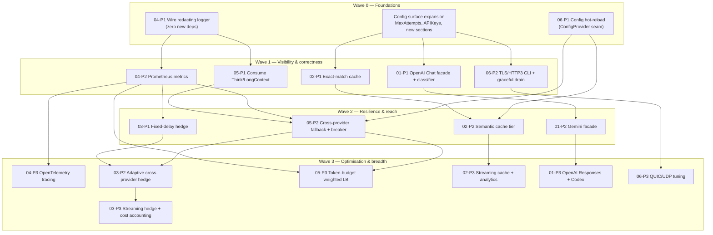

# Roadmap — sequencing the innovations

How the six themes' phases order into build waves, and where the hard
dependencies are. The guiding principle: **land the foundations that make every
other theme safer and measurable first** — observability so you can tell whether
a change helped, config surface so features can be turned on, hot-reload so they
can be reconfigured without downtime.

## Dependency graph



## Why this order (the load-bearing dependencies)

- **04·P1 (wire the logger) is first and cheapest.** It adds no dependency —
  it only connects `internal/logging` + `logging_middleware.go`, which are
  already written — and it is the prerequisite for reasoning about every later
  change. Nothing else should ship before you can see request logs.
- **06·P1 (hot-reload) and the config-surface expansion are foundational.**
  Almost every later feature is configured (cache gates, hedge delay, routing
  thresholds, TLS, API keys, `MaxAttempts`). Introducing the `ConfigProvider`
  seam and hot-reload *before* those features means each one is reconfigurable
  from day one and can be invalidated cleanly on reload (the generation counter).
- **04·P2 (metrics) gates the tuning-heavy themes.** Hedging (03) and
  budget-aware routing (05·P3) are meaningless to tune without p95/p99 and
  token-rate visibility. Build the meters before the things they measure.
- **05·P1 → 05·P2 → 03.** Tier routing (05·P1) is a pure-function prerequisite
  for a sane fallback chain; cross-provider fallback + circuit breakers (05·P2)
  give hedging (03·P2) a *different, healthy* provider to hedge toward and a
  health signal to suppress hedging at a sick provider — so hedging's adaptive
  phase depends on routing's resilience phase.
- **02·P1 → 02·P2.** Exact-match caching (no embeddings, no new dep) proves the
  checkpoint and the safety gates before the semantic tier's correctness risk is
  introduced; the semantic tier also wants hot-reload's generation bust (06·P1).
- **01 stands mostly alone** (facades are additive endpoints) but wants the
  config surface (which facades to mount) and benefits from metrics/logging to
  observe the new traffic.

## Build waves at a glance

| Wave | Theme·Phase | Deliverable | New deps | Backward-compat posture |
|---|---|---|---|---|
| 0 | 04·P1 | Redacting access logs wired into the gateway + CLI | none | logs to stderr; wire-behaviour unchanged |
| 0 | 06·P1 | `ConfigProvider` seam + `Watcher` hot-reload in `serve.go` | none | `gateway.New` unchanged (static provider) |
| 0 | (cross) | Config surface: `MaxAttempts`, `APIKeys`, feature sections, all omittable | none | zero-value = today |
| 1 | 04·P2 | Prometheus `/metrics` (RED + gen_ai tokens) on mgmt server | `client_golang` | new control-plane route only |
| 1 | 05·P1 | `Think`/`LongContext` consumed via token estimate | none | unset tiers = today's routing |
| 1 | 01·P1 | OpenAI Chat facade + `RequestProtocolForPath` | none | facade off by default |
| 1 | 06·P2 | TLS/HTTP-3 CLI flags + graceful QUIC drain | none | no flags = plain HTTP as today |
| 1 | 02·P1 | Exact-match cache (in-mem; optional pure-Go SQLite) | opt. `modernc.org/sqlite` | off unless provider opts in |
| 2 | 05·P2 | Cross-provider fallback chain + circuit breaker | none | no fallbacks = single-provider as today |
| 2 | 03·P1 | Fixed-delay single-provider hedge (non-streaming) | none | off by default |
| 2 | 01·P2 | Gemini `generateContent` facade | none | facade off by default |
| 2 | 02·P2 | Semantic cache tier (embeddings + cosine) | embedder client | off by default |
| 3 | 04·P3 | OpenTelemetry tracing (GenAI semconv) | OTel SDK | no-op tracer when unconfigured |
| 3 | 03·P2/P3 | Adaptive + streaming hedge, cost accounting | none | off by default |
| 3 | 05·P3 | Token-budget-aware weighted load balancing | none | single-provider unaffected |
| 3 | 02·P3 | Streaming cache replay + analytics | none | off by default |
| 3 | 01·P3 | OpenAI Responses facade + Codex bridge | none | facade off by default |
| 3 | 06·P3 | QUIC/UDP tuning (`QUICConfig`, buffers, 0-RTT policy) | none | conservative defaults; 0-RTT off |

## Indicative timeline

Relative effort, not calendar commitments — a `mermaid` gantt for shape only.

```mermaid
gantt
    title Innovations — relative sequencing
    dateFormat X
    axisFormat %s
    section Foundations
    04·P1 wire logger            :a1, 0, 1
    06·P1 hot-reload             :a2, 0, 2
    config surface              :a3, 0, 2
    section Visibility & correctness
    04·P2 metrics                :b1, after a1, 2
    05·P1 tier routing           :b2, after a1, 2
    01·P1 OpenAI Chat facade     :b3, after a3, 3
    06·P2 TLS/HTTP3 CLI          :b4, after a3, 2
    02·P1 exact cache            :b5, after a3, 2
    section Resilience & reach
    05·P2 fallback + breaker     :c1, after b2, 3
    03·P1 fixed hedge            :c2, after b1, 2
    01·P2 Gemini facade          :c3, after b3, 3
    02·P2 semantic cache         :c4, after b5, 3
    section Optimisation & breadth
    04·P3 OTel tracing           :d1, after b1, 3
    03·P2 adaptive hedge         :d2, after c1, 2
    05·P3 budget LB              :d3, after c1, 3
    02·P3 streaming cache        :d4, after c4, 2
    01·P3 Responses + Codex      :d5, after c3, 3
    06·P3 QUIC tuning            :d6, after b4, 2
```



## Critical-path summary

The longest dependency chain — the one that determines how soon the most
advanced capability can land — is:

```
04·P1 → 04·P2 → 05·P2 → 03·P2 → 03·P3
(logger) (metrics) (fallback+breaker) (adaptive hedge) (streaming hedge)
```

Everything else can proceed in parallel branches off Wave 0. The two Wave-0
foundations (04·P1 logging, 06·P1 hot-reload) plus the config-surface expansion
unblock the widest set of downstream work for the least code, which is why they
are the recommended first commits.

## Guardrails that apply to every wave

Restated from the dossier README so they are not lost in sequencing:

1. **Default install behaviour never changes** — every feature's zero-value/
   absent-config state is today's gateway.
2. **No secret ever reaches a log, metric label, trace attribute, or cache key.**
3. **No feature may switch providers or sources mid-SSE-stream** — decisions are
   made before `streamAnthropicSSE` starts.
4. **Every new dependency is justified and, where possible, deferred** — Wave 0
   adds none; the first optional dep is pure-Go SQLite in 02·P1.
